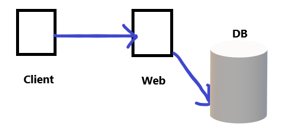

# 2019.12.18

## 1. DBMS

> **D**ata**B**ase**M**anagement**S**ystem으로 정형화된 데이터 저장 및 관리 시스템

오라클(주로 대기업), MySQL(주로 중소기업), MSSQL(주로 중소기업), 티베로 등...

* Sql

  : 오라클 같은 DBMS 시스템을 관리할 수 있는 언어

* DB Server

  : DBMS가 설치되어 있는 pc

서버는 항상 켜져있어야 된다. Oracle을 설치하면 자동으로 켜진 상태가 설정된다.

## 2. Oracle

* XE 버전 설치 확인 과정

- [ ] [관리도구](제어판\시스템 및 보안\관리 도구) 들어가서 **서비스** 아이콘 클릭해 서버가 실행되고 있는지 확인

- [ ] 오라클이 설치된 폴더안 ADMIN폴더로 가서 listener.ora와 tnsnames.ora파일을 열고 내용에 한글 경로가 없는지 확인

