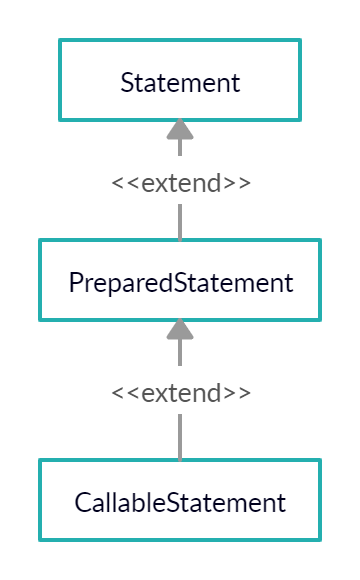

# 2019.12.23 

# JDBC

> 자바로 데이터베이스를 연결하는 기술
>
> SQL문을 자바로 만든 시스템을 통해 실행할 수 있도록 만들어진 자바의 기술

**[JDBC API 사용하기]**

* 이클립스를 사용하는 경우 (Application)
  1. 작업 중인 프로젝트 선택
  2. 프로젝트에서 단축메뉴 선택 -> Build path -> Configure Build path
  3. 대화상자에서 세 번째 탭인 Libraries 선택
  4. Add External jar... 선택하고 ojdbc6.jar 파일을 등록

## 1. 드라이버 로딩

> 어떤 DBMS를 사용하는지 인식시키는 작업
>
> 오라클에서 제공해준 드라이버 파일(oracle.jdbc.driver.OracleDriver)의 API를 접근해서 사용할 수 있도록 JVM의 메모리에 로딩시키는 작업을 하는 단계
>
> * MySQL : com.mysql.jdbc.Driver

* 여기서 메모리에 올리는 작업은 heap메모리에 올리는 작업이 아니다. java로 클래스를 만들면 클래스의 내용이 static영역에 올라간다. 

  그러나 외부 라이브러리로 불러온 **OracleDriver정보는 JVM이 모르기 때문에 클래스 정보를 로드해야 한다.** 

  그 작업이 **Class의 forName메서드**를 통해 **핵심 클래스를 로딩하는 것**이다.

* **OracleDriver(ojdbc6.jar)**

  : JDBC 드라이버, **핵심 클래스**로 소스에 접근할 수 없고 역컴파일 또한 불가능하다.

```java
Class.forName("oracle.jdbc.driver.OracleDriver");
			   ------------------
                   //패키지		------------
                   					//클래스
```

## 2. DBMS에 연결하기

> DBMS에 접속하기 위해서 DriverManager의 getConnection이라는 static 메서드를 제공
>
> getConnection 메서드는 매개변수로 전달하는 **접속 문자열을 보며 어떤 DBMS에 연결해야 하는지 판단**한다.
>
> **어떤 DBMS에 접속했냐**에 따라 모두 **다른 객체를 리턴**
>
> **DBMS에 접속하기 위해**서는 **ip 정보, port정보, 계정, 패스워드가 필요**하다.

* **jdbc:oracle:thin:@ip:port:데이터베이스 서비스 명**

  ex) jdbc:oracle:thin:@127.0.0.1(or localhost):1521:xe

  => jdbc:oracle:thin은 oracle 내부에서 통신하는 규칙명

  => 127.0.0.1과 localhost는 모두 현재 작업 중인 자기 pc를 나타낸다.
  
* jdbc:mysql://ip:port/데이터베이스명(port - 3306) => mysql

```java
//연결 문자열 - 어떤 DBMS를 쓰느냐에 따라 형식이 달라진다.
String url = "jdbc:oracle:thin:@localhost:1521:xe";
//            ----------------  -----------------
//     오라클에서 사용하는 프로토콜   DBMS가 설치되어 있는 pc의 ip

//접속계정
String user = "scott";

//접속계정 패스워드
String password = "tiger";

// 자바가 제공하는 인터페이스
//--------
Connection con = DriverManager.getConnection(url,user,password);
// DBMS에 연결 후 연결정보를 객체로 만들어서 리턴한다.
```

getConnection 메서드가 리턴하는 객체는 Connection 객체에 종속적이다. 그래서 **위처럼 부모형 참조변수에 객체를 받은 것**이다.

즉, 실제 실행되는 API는 ojdbc6.jar에 있는 내부가 숨겨진 .class 파일들이다. 

내부에서는 접속된 **DBMS회사에서 제공하는 라이브러리 속 Connection**이 리턴되도록 **다형성이 적용**되어 있다.

다시 말해서 java.sql.Connection을 implements 하고 있는 **oracle.jdbc.OracleConnection에 구현부가 숨겨져 있는 것**이다.

※ OracleConnection.class 파일의 내용을 확인하면 알기 쉽다.

※ SQL Exception에 대한 처리를 해야 한다.

## 3. Statement객체 생성하기

> SQL문을 실행하기 위한 역할을 담당하는 클래스는 Statement
>
> Statement 객체는 Connection 객체의 메서드를 이용하여 생성하도록 설계되어 있음
>
> 이것 또한 **연결된 DBMS에 따라 다른 Statement 객체가 생성**된다!



* Statement

  : 정적 SQL을 실행, 보안에 취약하다.(SQLInjection에 취약)

* PreparedStatement

  : 동적 SQL을 실행, 시큐어 코딩에 적합하다.

* CallableStatement

  : 각 DBMS에 특화된 SQL을 실행 (오라클: PL-SQL)

### Statement 객체를 이용

> Connection객체에 있는 createStatement메서드를 이용
>
> Connection정보를 유지해야 한다.

```java
Statement stmt = con.createStatement();
// java.sql.Statement를 implements 하고 있는 oracle.jdbc.Statement가 리턴된다.
```

#### SQL문 실행하기

>Statement 객체가 가진 execute를 통해 원하는 Sql문을 실행한다.

* Statement에 있는 모든 execute관련 메서드들은 모두 SQL 실행과 관련된 메서드이다.

  ※ 자세한 건 [API문서](https://docs.oracle.com/javase/8/docs/api/)를 참고하자

```java
String sql = "원하는 Sql 명령문 입력";

int result = stmt.executeUpdate(sql);
// DML 중 insert, update, delete SQL문을 실행할 수 있는 메서드
System.out.println(result + "개 행이 삽입 성공");
// executeUpdate() 메서드의 리턴값은 int형이다
// 몇 개의 row가 변경됐는지 리턴
// select는 리턴값이 다르겠지..?
```

자바 언어로 실행하는 SQL문은 자동으로 commit이 된다.

### PreparedStatement 객체를 이용

