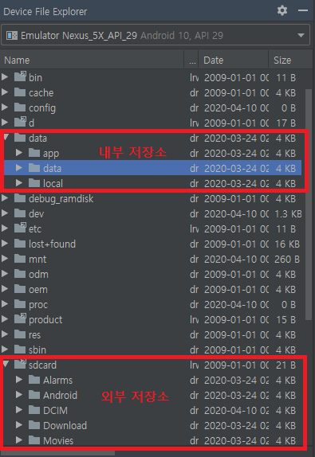
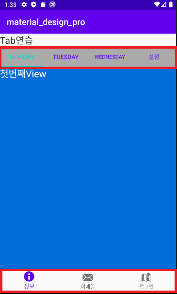
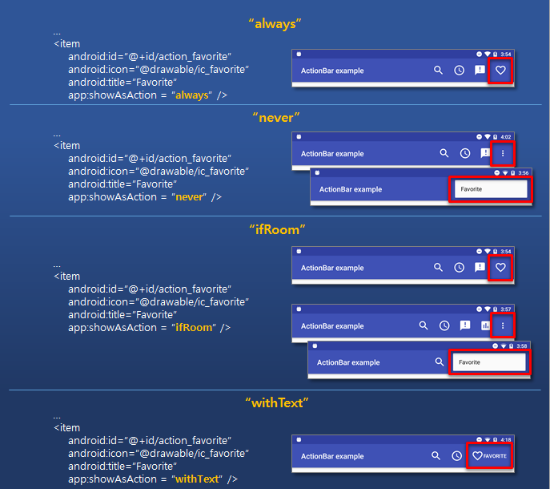

# Android

## Activity

### ViewGroup

#### Layout

> view를 어떻게 배치할 것인지, 어떤 방식으로 배치할 것인지를 
>
> 디자인 할 수 있는 요소
>
> 중첩 사용도 가능하다

* 공통 속성

  * layout_width : view의 너비

  * layout_height : view의 높이

    * match_parent

      : 부모의 크기(너비, 높이)에 딱 맞게 그리겠다

    * wrap content

      : 자기의 기본 사이즈

  * orientation

    : 배치 방향

      default는 horizontal, vertical로 변경 가능

  * id

    : 각 위젯을 식별할 수 있는 이름

  * margin 

    : 주위 여백

  * padding 

    : 내부 컨텐츠와 border 사이의 간격

  * layout_weight 

    : 여백에 대한 비율

  * layout_gravity

    : parent내부에서 현재 view의 정렬

  * gravity

    : view 내부에서의 정렬

* 종류
  * ConstraintLayout

    : 외부 라이브러리, 제약 조건 기반 모델

     상위 view나 부모를 기준으로 위치를 정하는 layout

  * LinearLayout

    : 박스 모델, 나열하는 형식의 layout
  
    * LayoutParams
  
      : 레이아웃에 줄 수 있는 속성을 정의하는 객체
  
  * RelativeLayout
  
    : 다른 뷰와의 상대적인 위치를 이용해 view의 위치를 결정
  
  * TableLayout
  
    : Linear와 비슷하지만 table로 관리할 수 있어 편리하다
  
    * stretchColumns
  
      : linear의 weight 속성을 주는 것과 비슷한 방식으로
  
      각 요소가 TableRow에서 차지하는 영역을 결정
  
  * FrameLayout
  
    : 여러 장을 띄워놓고 선택에 따라 보여줄 화면을 정할 때 주로 사용
  
    내부 요소에 visibility 속성을 적용해 사용
    
    * visibility
      * gone : 메모리에 올라가지 않고 보이지 않음
      * visible : 메모리에 올라가고 보임
      * invisible : 메미로에 올라가고 보이지 않음
  
* tools

  > 안드로이드의 속성이 아니라 안드로이드 스튜디오에서만 적용되는 속성

#### Text

> 문자열을 디자인 할 수 있는 view 요소
>
> email, password, address, date 등 다양한 요소로 text를 표현할 수 있다

* TextView

  * textAppearance

    : OS가 다 다르기 때문에 폰트의 사이즈를 정하기 어려움

    이 속성으로 모든 기기에 호환되는 텍스트 크기를 선택할 수 있다

* String의 리소스화

  > res의 value 폴더 안 strings에 텍스트를 등록한 후 사용할 수 있다

### Widget

> 실제 화면에 구현되는 view 요소들

* TextView

* Button

* ScrollView

  * 하위는 한 개이어야만 한다.

  * fillViewport속성을 true로 추가

* 기타 등등 ...

### manifests

> 전체 프로젝트의 설정 정보가 저장되어 있는 xml 파일

```java
<intent-filter>
    <action android:name="android.intent.action.MAIN" />
    <category android:name="android.intent.category.LAUNCHER" />
</intent-filter>
```

시작 activity는 항상 이 요소가 설정되어 있어야 한다.

## Event

> 윈도우의 클릭 이벤트처럼 안드로이드에서도 터치나 키패드 이벤트를 처리할 수 있다.

* OnClickListener

  > 이벤트가 발생하면 즉시 동작할 수 있도록 만들어주는 리스너

  * 인터페이스로 정의되어 있다

    : 다양한 방식으로 이벤트를 처리할 수 있기 때문

  ```java
  public void ActivityClickListener implements 
      								view.OnClickListener {
      @Override
      public void onClick(View v) {
          //클릭이벤트 시 처리할 내용
      }
  }
  ```

  * 익명 이너 클래스

    ```java
    btn.setOnClickListener(new View.OnClickListener() {
        @Override
        public void onClick(View v) {
            //처리할 내용
        }
    });
    ```

    ```
    new 인터페이스명() => 지정한 인터페이스의 하위객체를 만들어서
    매개변수로 전달하겠다는 의미
    ```

## Inflator

>xml로 정의된 view를 실제 객체화 시키는 용도

* 미리 xml로 디자인한 view를 java코드에서 Inflator를 활용해 바로 생성이 가능하다

* inflation이란?

  > 레이아웃 xml에 명시한 위젯이 안드로이드 메모리에 생성되는 과정을 말함

  ```java
  setContintView();
  // xml레이아웃을 인플레이션 한 후 화면에 보여주는 기능
  // 인플레이션 된 위젯을 화면에 구성하는 기능
  ```

### LayoutInflator

> LayoutView를 생성할 수 있는 객체
>
> ---
>
> ↓ 아래 코드로 가져올 수 있다.

```java
LayoutInflator Inflator = (LayoutInflator)getSystemService(Context.LAYOUT_INFLATOR_SERVICE);
```

* `Inflate()`

  > xml에 쓰여있는 view의 정의를 실제 view 객체로 만드는 역할
  >
  > **compile time에 완성된 xml 파일**에 대해서만 적용 가능
  >
  > 즉, **R. 으로 시작되는 resource파일들만** inflate가 가능하다.

## Adapter

> 앱을 구성하는 목록을 만드는 객체

### 사용자 정의 Adapter 만들기

> 안드로이드에서 앱을 구성할 때 목록형식을 가장 많이 사용
>
> 사용자 정의로 디자인한 뷰를 목록으로 사용하고 싶은 경우
>
> 인드로이드 내부에서 제공하는 Adapter로 표현하고 싶은 내용을 모두 표현할 수 없다.(이벤트 연결, 각 목록의 구성을 다르게 생성...)

* 구성요소

  * `Adapter`를 이용해서 출력할 데이터를 저장하는 객체(`DTO` or `VO`)

  * 사용자 정의 `Adapter`

    1. 안드로이드에서 제공하는 `Adapter`클래스를 상속

       > 리스트 뷰를 만들 때 필요한 정보를 저장할 수 있도록 멤버변수 정의
       >
       > Context, row 디자인 리소스, 데이터

    2. 생성자 정의

       > 상속받고 있는 `ArrayAdapter`의 생성자 호출

    3. `ArrayAdapter`에 정의되어 있는 메서드를 오버라이딩

       > `getView` : 리스트 뷰의 한 항목이 만들어질때마다 호출
       >
       > ---
       >
       > ​			  => 전달된 리소스를 이용해서 뷰를 생성(`LayoutInflator`)
       >
       > ​			  => 한 row를 구성하는 뷰를 찾아서 데이터와 연결

    4. `getView`메서드에서 성능개선을 위한 코드를 작성

       > 한 번 생성한 뷰를 재사용
       >
       > `findViewById`는 한 번만 찾아오기

    5. `ViewHolder`객체를 생성

       > row를 구성하는 뷰를 `findViewById`하는 작업을 한 번만
       >
       > row에 대한 구성 View를 멤버변수로 선언
       >
       > 생성자에서  `findViewById`처리를 구현
       >
       > 최초로 뷰를 만들 때(row에 대한 뷰) 이 객체를 생성해서 활용

    6. row를 구성하는 뷰에 상태값을 저장하기

       > 각 뷰의 이벤트를 통해 저장
       >
       > ---
       >
       > 각 뷰의 상태값을 저장할 수 있도록 객체 생성
       >
       > -> 상태값을 저장한 객체를 자료구조에 저장
       >
       > ​	focus를 잃어버릴 때 상태를 저장

  * `Adapter`를 통해 만들어진 리스트뷰를 보여줄 액티비티

    * main layout 필요

## Intent

> 실행할 액티비티의 정보를 담고 있는 객체
>
> 데이터를 담아서 뷰끼리 공유할 수 있게 해줌

* 기본실행 과정

  1. 인텐트 객체를 생성하고 실행할 액티비티의 정보와 **데이터**를 세팅

     * 값

       ```java
       putExtra()
       ```

     * 객체

       >인텐트에 객체를 공유하고 싶은 경우 반드시 Parcelable 타입으로 정의

  2. 안드로이드 OS에 인텐트 객체를 넘겨주며 의뢰

     > 액티비티 실행 명령어
     >
     > `startActivity(인텐트 객체)`
     >
     > `startActivityForResult(인텐트 객체, 상수)`

  3. 인텐트에 설정되어 있는 액티비티 호출

  4. 호출된 액티비티에서는 안드로이드 OS가 넘겨준 인텐트를 가져온다.

  5. 인텐트에 저장된 데이터를 꺼내서 활용하는 작업

* 명시적 Intent

  > 앱 내에서 어떤 class에게 정보를 보낼지 지정해 Intent를 생성하는 것

### Parcelable

> 패킷과 비슷한 방식으로 안드로이드끼리 객체를 공유할 때 정의해야 한다

* Creator
  1. OS에서 객체를 꺼낼 때 Parcelable 객체에서 CREATOR 변수를 찾아 `createFromParcel`을 실행한다.
  2. Parcelable에 공유된 Parcel 정보를 읽어 해당 정보를 가진 객체를 생성해 반환한다.

## Permission

> 폰 내부에서 사용할 권한
>
> ex) 다른 앱 접근 권한

### 종류

* 일반권한 
* 위험 권한

### 사용 방법

* manifest 파일에 정의

  ```java
  <permission 
      android:name="com.exam.permission.JAVA_PERMISSION" //권한 이름
      android:label="JAVA_PERMISSION"	//어떤 권한인지 명시
      android:description="@string/per_msg" //권한 내용 요약
      android:protectionLevel="normal"> //권한 종류
  </permission>
  ```

* 사용하는 곳 manifest

  ```java
  <uses-permission
      android:name="com.exam.permission.JAVA_PERMISSION" />
       			//------------------------------------
          		//	등록한 곳과 같은 이름
  ```

### 위험권한

> 액티비티를 실행하거나 버튼을 누르거나 어떤 기능을 사용할 때 권한에 대한 처리를 할 수 있도록 구현
>
> ---
>
> 일반 권한과 달리 `uses-permission`정의와 함께 추가로 코드를 작성해주어야 한다.
>
> 앱 실행 시점에 권한을 체크한다.

#### 사용 메서드

* `checkSelfPermission()`

  : 퍼미션의 현재 상태를 확인하는 메서드

  * PERMISSION_DENIED

    : 퍼미션이 부여되지 않은 상태

  * PERMISSION_GRANTED

    : 퍼미션이 부여되어 있는 상태

* `requestPermissions()`

  : 권한이 체크되어 있지 않은 경우에 권한을 요청하는 메시지를 표시

  (이 메서드 이 외에도 제공되는 메서드는 여러 개)

  * PERMISSION_DENIED(return 값)
  * PERMISSION_GRANTED(return 값)

* `onRequestPermissionResult()`

  : requestPermissions의 결과로 호출되는 메서드

    퍼미션 설정 정보를 매개변수로 넘긴다.

  * requestCode

    : 퍼미션 요청할 때 넘긴 요청코드

  * permissions

    : 요청 퍼미션 목록

  * grantResults

    : 퍼미션 설정 성공 결과

#### 처리순서

1. 현재 사용하려고 하는 권한이 설정되어 있는지 체크

   `-` `checkSelfPermission()`

2. 1번에서 리턴값이 PERMISSION_DENIED인 경우 사용자가 권한을 설정할 수 있도록 메시지를 표시

   `-` `requestPermissions()`

3. 요청 처리 후 자동으로 호출되는 메서드를 통해 다음에 어떤 처리를 할 것인지 정의

   * 권한 성공 

     -> 기능이 실행되도록

   * 권한 실패

     -> Preference를 통해 설정할 수 있도록 액티비티를 이동 or 안내 메시지 출력

## FileSystem



> 내부저장소는 앱을 삭제하면 관련 내용이 지워지지만 외부는 남는다.
>
> 자바 기반이기 때문에 io로 파일시스템에 접근할 수 있다.

### 외부저장소

> 내부 저장소와 달리 권한을 설정해줘야 한다.

* WRITE_EXTERNAL_STORAGE

  : 이전 버전에서 사용했으나 현재는 바뀐 정책으로 사용하지 않는다.

    위 퍼미션을 체크하려면 코드를 추가해야 한다.

  ```java
  android:requestLegacyExternalStorage="true"
      //이전 정책을 사용하겠다
  ```

* 앱이 삭제될 때 같이 삭제하는 방법도 있다.

## Preference

### SharedPreference

> 설정 정보를 저장할 수 있도록 지원되는 객체

* editor

  : 설정 정보를 기록할 때 필요한 객체

  ```java
  editor.putString("first", first_edit.getText().toString());
  editor.putString("second", secod_edit.getText().toString());
  editor.putBoolean("noti", noti.isChecked());
  editor.putBoolean("siren", siren.isChecked());
  editor.commit();
  ```

  앱 종료 후 다시 앱을 실행했을 때 설정 정보가 남아있는 것을 확인할 수 있다.

## Fragment

> 여러 개의 프래그먼트를 하나의 액티비티에 결합하여 창이 여러 개인 UI를 빌드할 수 있으며, 하나의 프래그먼트를 여러 액티비티에서 재사용할 수 있습니다. 
>
> 프래그먼트는 액티비티의 모듈식 섹션이라고 생각하면 됩니다.
>
> ex) tiles와 비슷한 개념이라고 생각하면 됨
>
> ---
>
> 한 화면에서 복잡한 기능을 보여줘야 할 때 사용함
>
> ex) 카카오톡, 페이스북

* LinearLayout과 사용했을 때 주의

  ```markdown
  * weight은 여백을 기준으로 가중치를 주겠다는 의미이기 때문에 **리니어 레이아웃**에 두 개 이상의 자식이 있고 한 자식에게만 weight 속성에 1을 주면 다른 한 자식이 보이지 않는다.
  ```

* 액티비티에 종속적이다.

  ```markdown
  * 액티비티의 lifecycle
  액티비티는 back Stack에 쌓여 '뒤로' 버튼을 누르면 스택에서 하나씩 제거된다. 스택에 더 이상 액티비티가 존재하지 않으면 앱이 종료된다.
  ```

  그러나 `addToBackStack()`으로 액티비티처럼 동작하게 할 수 있다.

  ```java
  transaction.addToBackStack("first");
  						//--------
  						//백스택에 넣을 이름 지정 null로 해도 됨
  ```


## Bar

### menuBar

> 안드로이드에서 메뉴 바



res 폴더에 resource directory를 추가하여 menu bar의 아이템을 설정해줄 수 있다.

* option menu

### ActionBar

> 디폴트로 지정

* showAsAction 속성값
  * always

    : 아이템을 항상 앱바의 액션으로 표시

    never와 ifRoom보다 우선, 공간이 없으면 표시되지 않음

  * never

    : 아이템을 앱바의 액션을 표시하지 않고 오버플로우 메뉴에 바로 표시

  * ifRoom

    : 만약 공간이 있다면 앱바의 액션으로 표시, 아니면 오버플로우 메뉴에 표시

  * collapseActionView

    : 아이템에 커스텀 액션 뷰가 지정된 경우, 축소된 형태로 표시

  * withText

    : 지정한 아이콘과 텍스트 같이 보여줌

  

### ToolBar

> ActionBar와 같은 기능이지만 사용자 정의로 확장 가능성이 높음