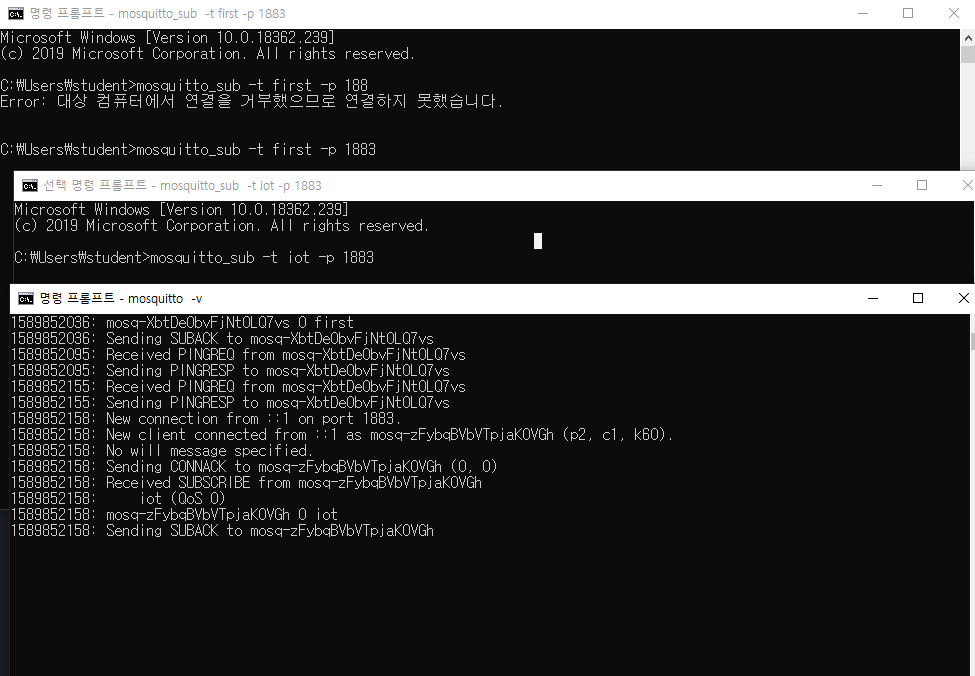

# MQTT

> IoT 시스템에서 사용하는 서버, 실제 현업에서 사용한다고 함.

* 설치
  * http://mosquitto.org/download/에서 x64 버전 다운
  * cmd 창을 열어 `mosquitto -v` 명령을 통해 서버를 올린다. 
  * 아래는 `mosquitto_sub`로 클라이언트를 생성한 결과이다.
    * -t : 토픽 명
    * -p : 포트 번호



* 메시지 보내기

  * `mosquitto_pub`로 메시지 전송 가능

    * -h : 메시지를 받을 ip 주소
    * -t : 토픽 명
    * -p : 포트 번호
    * -m : 메시지 내용 작성할 수 있는 태그

    ```markdown
    * mosquitto_pub -h 70.12.116.75 -t iot -p 1883 -m "김민정 천재"
    ```

    

