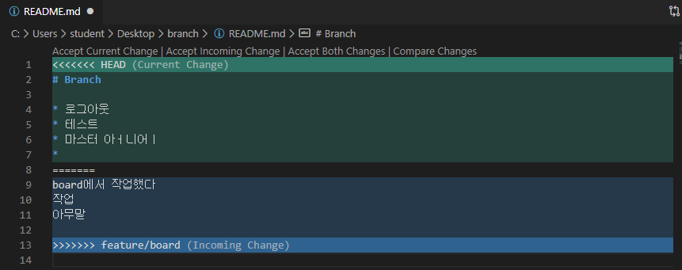

# Git branch

## 1. branch 관련 명령어

> Git 브랜치를 위해 root-commit을 발생시키고 진행하세요.

1. 브랜치 생성

   ```bash
   (master) $ git branch {브랜치명}
   ```

2. 브랜치 이동

   ```bash
   (master) $ git checkout {브랜치명}
   ```

3. 브랜치 생성 및 이동

   ```bash
   (master) $ git checkout -b {브랜치명}
   ```

4. 브랜치 삭제

   ```bash
   (master) $ git branch -d {브랜치명}
   ```

5. 브랜치 목록

   ```bash
   (master) $ git branch
   ```

6. 브랜치 병합

   ```bash
   (master) $ git merge {브랜치명}
   ```

   - master 브랜치에서 {브랜치명}을 병합

## 2. branch 병합 시나리오

> branch 관련된 명령어는 간단하다.
>
> 다양한 시나리오 속에서 어떤 상황인지 파악하고 자유롭게 활용할 수 있어야 한다.

### 상황 1. fast-foward

> fast-foward는 feature 브랜치 생성된 이후 master 브랜치에 변경 사항이 없는 상황

1. feature/test branch 생성 및 이동

   ```bash
   (master) $ git checkout -b feature/test
   Switched to a new branch 'feature/test'
   (feature/test) $
   ```

2. 작업 완료 후 commit

   ```bash
   $ git commit -m 'test 작업'
   [feature/test 5d8fc4a] test 작업
    1 file changed, 0 insertions(+), 0 deletions(-)
    create mode 100644 test.txt
   ```

3. master 이동

   ```bash
   $ git checkout master
   Switched to branch 'master'
   ```

4. master에 병합

   ```bash
   $ git merge feature/test
   Updating a0c6789..5d8fc4a
   Fast-forward
    test.txt | 0
    1 file changed, 0 insertions(+), 0 deletions(-)
    create mode 100644 test.txt
   ```

   * **반드시!!** 병합이 될 브랜치에서 명령어를 입력한다.

5. 결과 -> fast-foward (단순히 HEAD를 이동)

   ```bash
   $ git log --oneline
   5d8fc4a (HEAD -> master, feature/test) test 작업
   a0c6789 Complete menu
   b2abc30 Init
   ```

6. branch 삭제

   ```bash
   $ git branch -d feature/test
   Deleted branch feature/test (was 5d8fc4a).
   ```

------

### 상황 2. merge commit

> 서로 다른 이력(commit)을 병합(merge)하는 과정에서 **다른 파일이 수정**되어 있는 상황
>
> git이 auto merging을 진행하고, **commit이 발생된다.**

1. feature/signout branch 생성 및 이동

   ```bash
   $ git checkout -b feature/signout
   Switched to a new branch 'feature/signout'
   ```

2. 작업 완료 후 commit

   ```bash
   $ git commit -m 'Complete signout'
   [feature/signout 2a597b0] Complete signout
    1 file changed, 0 insertions(+), 0 deletions(-)
    create mode 100644 signout.txt
   ```

3. master 이동

   ```bash
   $ git checkout master
   Switched to branch 'master'
   ```

4. *master에 추가 commit 이 발생시키기!!*

   - **다른 파일을 수정 혹은 생성하세요!**

   ```bash
   $ git commit -m 'Hotfix'
   [master b621592] Hotfix
    1 file changed, 0 insertions(+), 0 deletions(-)
    create mode 100644 hotfix.txt
   ```

5. master에 병합

   ```bash
   (master) $ git merge feature/signout
   Merge made by the 'recursive' strategy.
    signout.txt | 0
    1 file changed, 0 insertions(+), 0 deletions(-)
    create mode 100644 signout.txt
   ```

1. 결과 -> 자동으로 *merge commit 발생*

   - vim 편집기 화면이 나타납니다.

   - 자동으로 작성된 커밋 메시지를 확인하고, `esc`를 누른 후 `:wq`를 입력하여 저장 및 종료를 합니다.

     - `w` : write
     - `q` : quit

   - 커밋을 확인 해봅시다.

     ```bash
     $ git log --oneline
     8f60c53 (HEAD -> master) Merge branch 'feature/signout'
     b621592 Hotfix
     2a597b0 (feature/signout) Complete signout
     5d8fc4a test 작업
     a0c6789 Complete menu
     b2abc30 Init
     ```

2. 그래프 확인하기

   ```bash
   $ git log --oneline --graph
   *   8f60c53 (HEAD -> master) Merge branch 'feature/signout'
   |\
   | * 2a597b0 (feature/signout) Complete signout
   * | b621592 Hotfix
   |/
   * 5d8fc4a test 작업
   * a0c6789 Complete menu
   * b2abc30 Init
   ```

3. branch 삭제

   ```bash
   $ git branch -d feature/signout
   Deleted branch feature/signout (was 2a597b0).
   ```

------

### 상황 3. merge commit 충돌

> 서로 다른 이력(commit)을 병합(merge)하는 과정에서 **같은 파일의 동일한 부분이 수정**되어 있는 상황
>
> git이 auto merging을 하지 못하고, 충돌 메시지가 뜬다.
>
> 해당 파일의 위치에 표준형식에 따라 표시 해준다.
>
> **원하는 형태의 코드로 직접 수정**을 하고 직접 commit을 발생 시켜야 한다.

1. feature/board branch 생성 및 이동

   ```bash
   $ git checkout -b feature/board
   Switched to a new branch 'feature/board'
   ```

2. 작업 완료 후 commit

   ```bash
   $ git commit -m 'Complete board'
   [feature/board 6deaa5a] Complete board
    1 file changed, 0 insertions(+), 0 deletions(-)
    create mode 100644 board.txt
    
   $ git commit --amend
   [feature/board e1a4978] Complete board, Fix README.md
    Date: Fri Apr 24 11:05:38 2020 +0900
    2 files changed, 4 insertions(+)
    create mode 100644 board.txt
   ```

3. master 이동

   ```bash
   $ git checkout master
   Switched to branch 'master'
   ```

4. *master에 추가 commit 이 발생시키기!!*

   - **동일 파일을 수정 혹은 생성하세요!**

   ```bash
   $ git commit -m 'Update README'
   [master d6414eb] Update README
    1 file changed, 6 insertions(+)
   ```

5. master에 병합

   ```bash
   (master) $ git merge feature/board
   Auto-merging README.md
   CONFLICT (content): Merge conflict in README.md
   Automatic merge failed; fix conflicts and then commit the result.
   ```

1. 결과 -> *merge conflict발생*

   > git status 명령어로 충돌 파일을 확인할 수 있음.

   ```bash
   (master|MERGING) $ git status
   On branch master
   You have unmerged paths.
     (fix conflicts and run "git commit")
     (use "git merge --abort" to abort the merge)
   
   Changes to be committed:
           new file:   board.txt
   
   Unmerged paths:
     (use "git add <file>..." to mark resolution)
           both modified:   README.md
   ```

2. 충돌 확인 및 해결

   

3. merge commit 진행

   ```bash
   $ git commit
   [master a3a4cd5] Merge branch 'feature/board'
   ```

   - vim 편집기 화면이 나타납니다.

   - 자동으로 작성된 커밋 메시지를 확인하고, `esc`를 누른 후 `:wq`를 입력하여 저장 및 종료를 합니다.

     - `w` : write
     - `q` : quit

   - 커밋이 확인 해봅시다.

     ```bash
     $ git log --oneline
     a3a4cd5 (HEAD -> master) Merge branch 'feature/board'
     d6414eb Update README
     e1a4978 (feature/board) Complete board, Fix README.md
     8f60c53 Merge branch 'feature/signout'
     b621592 Hotfix
     2a597b0 Complete signout
     5d8fc4a test 작업
     a0c6789 Complete menu
     b2abc30 Init
     ```

4. 그래프 확인하기

   ```bash
   $ git log --oneline --graph
   *   a3a4cd5 (HEAD -> master) Merge branch 'feature/board'
   |\
   | * e1a4978 (feature/board) Complete board, Fix README.md
   * | d6414eb Update README
   |/
   *   8f60c53 Merge branch 'feature/signout'
   |\
   | * 2a597b0 Complete signout
   * | b621592 Hotfix
   |/
   * 5d8fc4a test 작업
   * a0c6789 Complete menu
   * b2abc30 Init
   ```

5. branch 삭제

   ```bash
   $ git branch -d feature/board
   Deleted branch feature/board (was e1a4978).
   ```

