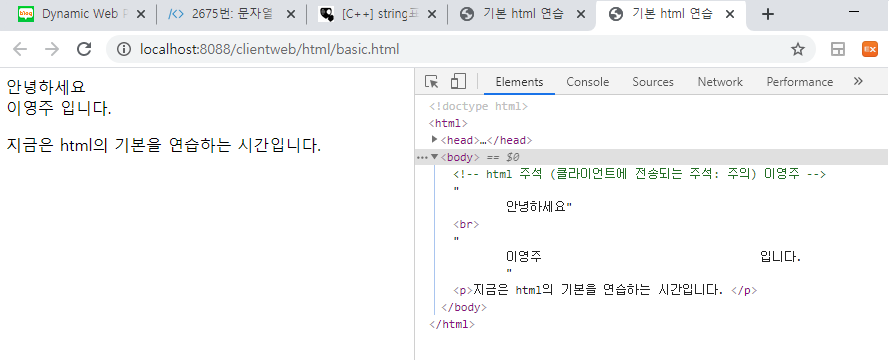

# HTML

* 정적 페이지

  > 아예 파일로 만들어진 문서를 말함. 
  >
  > 누가 실행하는지에 따라 결과가 달라지지 않는 페이지

## tag

```html
<head>
</head>
<body>
	안녕하세요<br/>
    		<!-- 중간에 내용이 없이 바로 닫는 것도 가능하다 -->
	이영주                                  입니다.
</body>
<!-- 공백은 한 개만 구분한다 -->
```

띄어쓰기를 여러 개 주는 기능 또한 태그로 정해져 있다. 

모든 html의 보여지는 모습들은 tag를 사용해서 직접 지정해줘야 한다.

* 주석 주의!!

  

  클라이언트에게 내용이 보이는 주석이라 중요한 내용은 적지 않는다.

### h

> 크기별로 글을 쓸 수 있는 태그
>
> h1 ~ h6까지 있다.

```html
<h1>HTML연습중....</h1>
```

### title

> 사용자에게 보여지는 창의 이름을 지정하는 태그

```html
<title>기본 html 연습</title>
```

### br & p

> 줄 바꿈

* br

  : 줄만 바꾸는 태그

* p

  : 문단을 바꾸는 태그, 아예 새로운 단락을 만든다. (한 줄 정도의 빈 줄을 추가한다.)

### hr

>horizontal line

### pre

> 작성한 그대로 보여지게 하는 태그 (띄어쓰기, 줄 바꿈 다 보여줌)

### font

> 글씨에 기본적인 스타일을 적용하는 태그

```html
<font size="1" color="red" face="굴림">HTML연습중.....</font>
<!-- size는 최대 6까지 -->
```

### b & i

> **bold**			*italic*

### 특수문자

> `&nbsp;` : 스페이스를 누른 것과 같은 효과
>
> `&lt;`: `<`
>
> `&gt;`: `>`
>
> `&quot;`: `"`
>
> `&amp;`: `&`

### img

> 웹 페이지에 이미지를 삽입할 때 사용

```html

```

* 경로
  * **.** : 현재 경로
  * **..** : 현재 경로에서 한 번 상위로 간 위치

### ul & ol

> **u**nordered **l**ists : 순서가 없는 목록
>
> **o**rdered **l**ists : 순서가 있는 목록

* li

  ```html
  <ul>
      <li>에스프레소</li>
      <li>아메리카노</li>
      <li>카페라떼</li>
  </ul>
  ```

### dl

> **d**efinition **l**ists

* dt & dd

  > **d**efinition **t**itle
  >
  > **d**efinition **d**etails

  ```html
  <dl>
  	<dt>정의할 무언가</dt>
  		<dd>내용</dd>
  	<dt>정의할 무언가 2</dt>
  		<dd>내용</dd>
  </dl>
  ```

### a

> 다른 페이지로 링크 생성

* href

  > 링크의 목적지

* target

  > 링크 생성 방식 설정 

  * `_blank` : 현재 페이지는 그대로 두고 새로운 탭에 페이지를 생성

    ​				 explorer의 경우 팝업 표시 방식에 따라 새 창에서 열릴 수도 있다.

  * `_self` : 현재 페이지를 없애고 그 탭에 새로운 페이지 생성

    기본 설정은 `_self`다.

```html
<a href="https://www.naver.com/" target="_blank">네이버</a>
```

### table

> 표를 만드는 태그
>
> 기본 설정은 테두리가 없다.

* * `border` : 테이블의 테두리를 만들고 바깥 테두리 선의 굵기를 설정한다.

* tr

  > **t**able **r**ow로 하나의 행 생성

  * `bgcolor` : 해당 행의 배경 색상을 설정한다.

* th

  > **t**able **h**eader로 열의 제목

* td

  > **t**able **d**ata 즉, 칸 하나의 내용

  * `colspan` : 행 방향으로 n개를 합친다. 당연히 n은 테이블 열의 개수보다 클 수 없다.
  * `rowspan` : 열 방향으로 n개를 합친다. 상위 행에서 현재 칸까지 합쳤을 경우 현재 행에서 그 칸은 사용할 수 없다. 

```html
<table border="1" width="500" height="500">
		<tr bgcolor="skyblue">
			<th>번호</th>
			<th>제목</th>
			<th>저자</th>
		</tr>
</table>
```

### form

> 사용자로부터 데이터를 받아서 서버로 넘기는 데 사용
>
> 정보를 넣을 수 있는 입력 필드를 가지고 있음
>
> 모든 양식관련 태그는 이 태그로 묶어줘야 함

* * action
  * method

* input

