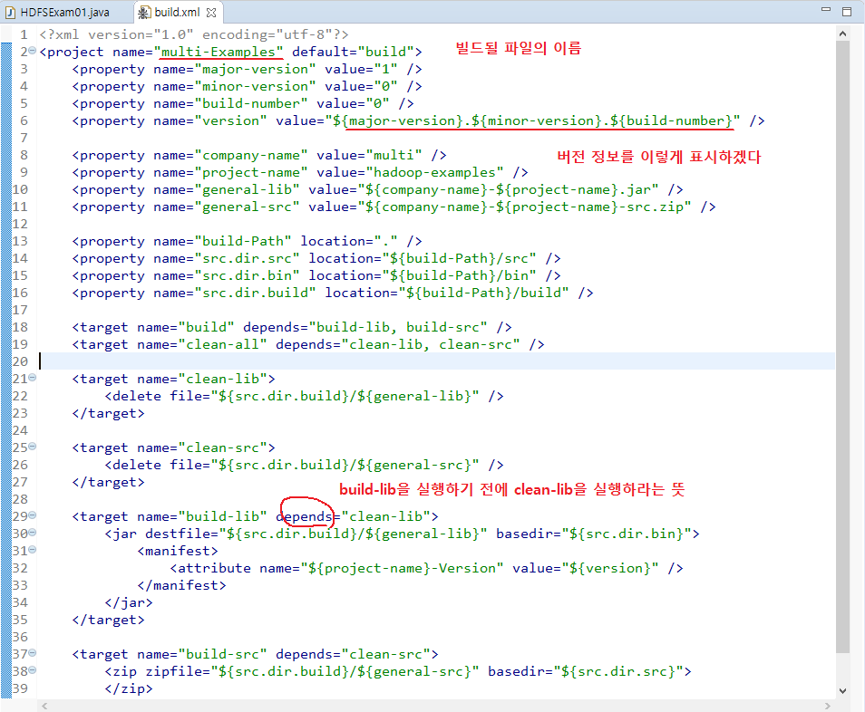

# STS를 통한 hdfs

> 리눅스에서 이클립스 설치하는 일이 말도 안되게 짜증나는 일이기 때문에 밖에서 설치한 이클립스를 이용해 접근한다.

* build.xml

  > 실행파일을 만드는 설정정보가 담겨있는 설정파일

  

  빌드 된 파일은 hadoop01의 /home/hadoop으로 이동시킨다.
* .java파일의 내용이 변경된다면 반드시 재빌드 후 실행파일 복사&이동 과정을 반복해야 한다.
  
* 실행하기

  > `/home/hadoop/hadoop-1.2.1/bin/hadoop jar multi-hadoop-examples.jar hdfs.exam.HDFSExam01 매개변수1, 2, ...`

  * 만든 빌드 파일은 위 명령을 통해 hadoop에서 실행할 수 있다.
* .java파일을 쓸 때는 패키지 경로까지 정확하게 입력한다.
  
```markdown
  * 우리가 만든 클래스로 읽을 수 있는 파일은 현재 로컬에 있는 파일이 아닌 하둡시스템 안에 있는 파일들이다.
```

  