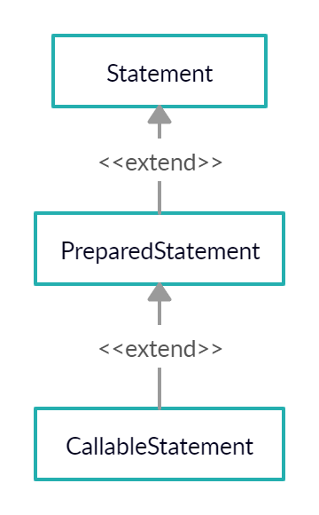

# JDBC

> 자바로 데이터베이스를 연결하는 기술
>
> SQL문을 자바로 만든 시스템을 통해 실행할 수 있도록 만들어진 자바의 기술

**[JDBC API 사용하기]**

* 이클립스를 사용하는 경우 (Application)
  1. 작업 중인 프로젝트 선택
  2. 프로젝트에서 단축메뉴 선택 -> Build path -> Configure Build path
  3. 대화상자에서 세 번째 탭인 Libraries 선택
  4. Add External jar... 선택하고 ojdbc6.jar 파일을 등록

## 1. 드라이버 로딩

> 어떤 DBMS를 사용하는지 인식시키는 작업
>
> 오라클에서 제공해준 드라이버 파일(oracle.jdbc.driver.OracleDriver)의 API를 접근해서 사용할 수 있도록 JVM의 메모리에 로딩시키는 작업을 하는 단계
>
> * MySQL : com.mysql.jdbc.Driver

* 여기서 메모리에 올리는 작업은 heap메모리에 올리는 작업이 아니다. java로 클래스를 만들면 클래스의 내용이 static영역에 올라간다. 

  그러나 외부 라이브러리로 불러온 **OracleDriver정보는 JVM이 모르기 때문에 클래스 정보를 로드해야 한다.** 

  그 작업이 **Class의 forName메서드**를 통해 **핵심 클래스를 로딩하는 것**이다.

* **OracleDriver(ojdbc6.jar)**

  : JDBC 드라이버, **핵심 클래스**로 소스에 접근할 수 없고 역컴파일 또한 불가능하다.

```java
Class.forName("oracle.jdbc.driver.OracleDriver");
			   ------------------
                   //패키지		------------
                   					//클래스
```

## 2. DBMS에 연결하기

> DBMS에 접속하기 위해서 DriverManager의 getConnection이라는 static 메서드를 제공
>
> getConnection 메서드는 매개변수로 전달하는 **접속 문자열을 보며 어떤 DBMS에 연결해야 하는지 판단**한다.
>
> **어떤 DBMS에 접속했냐**에 따라 모두 **다른 객체를 리턴**
>
> **DBMS에 접속하기 위해**서는 **ip 정보, port정보, 계정, 패스워드가 필요**하다.

* **jdbc:oracle:thin:@ip:port:데이터베이스 서비스 명**

  ex) jdbc:oracle:thin:@127.0.0.1(or localhost):1521:xe

  => jdbc:oracle:thin은 oracle 내부에서 통신하는 규칙명

  => 127.0.0.1과 localhost는 모두 현재 작업 중인 자기 pc를 나타낸다.
  
* jdbc:mysql://ip:port/데이터베이스명(port - 3306) => mysql

```java
// 연결 문자열 - 어떤 DBMS를 쓰느냐에 따라 형식이 달라진다.
String url = "jdbc:oracle:thin:@localhost:1521:xe";
//            ----------------  -----------------
//     오라클에서 사용하는 프로토콜   DBMS가 설치되어 있는 pc의 ip

// 접속계정
String user = "scott";

// 접속계정 패스워드
String password = "tiger";

// 자바가 제공하는 인터페이스
//--------
Connection con = DriverManager.getConnection(url,user,password);
// DBMS에 연결 후 연결정보를 객체로 만들어서 리턴한다.
```

getConnection 메서드가 리턴하는 객체는 Connection 객체에 종속적이다. 그래서 **위처럼 부모형 참조변수에 객체를 받은 것**이다.

즉, 실제 실행되는 API는 ojdbc6.jar에 있는 내부가 숨겨진 .class 파일들이다. 

내부에서는 접속된 **DBMS회사에서 제공하는 라이브러리 속 Connection**이 리턴되도록 **다형성이 적용**되어 있다.

다시 말해서 java.sql.Connection을 implements 하고 있는 **oracle.jdbc.OracleConnection에 구현부가 숨겨져 있는 것**이다.

※ OracleConnection.class 파일의 내용을 확인하면 알기 쉽다.

※ SQL Exception에 대한 처리를 해야 한다.

※ Connection은 메서드마다 가지고 있어야 한다.

## 3. Statement객체 생성하기

> SQL문을 실행하기 위한 역할을 담당하는 클래스는 Statement
>
> Statement 객체는 Connection 객체의 메서드를 이용하여 생성하도록 설계되어 있음
>
> 이것 또한 **연결된 DBMS에 따라 다른 Statement 객체가 생성**된다!



* Statement

  : 정적 SQL을 실행, 보안에 취약하다.(SQLInjection에 취약)

* **PreparedStatement**

  : 동적 SQL을 실행, 시큐어 코딩에 적합하다.

* CallableStatement

  : 각 DBMS에 특화된 SQL을 실행 (오라클: PL-SQL)

### Statement 객체를 이용

> Connection객체에 있는 createStatement메서드를 이용
>
> Connection정보를 유지해야 한다.

```java
Statement stmt = con.createStatement();
// java.sql.Statement를 implements 하고 있는 oracle.jdbc.Statement가 리턴된다.
```

#### SQL문 실행하기

>Statement 객체가 가진 execute를 통해 원하는 Sql문을 실행한다.

* Statement에 있는 모든 execute관련 메서드들은 모두 SQL 실행과 관련된 메서드이다.

  ※ 자세한 건 [API문서](https://docs.oracle.com/javase/8/docs/api/)를 참고하자

```java
String sql = "원하는 Sql 명령문 입력";

int result = stmt.executeUpdate(sql);
// DML 중 insert, update, delete SQL문을 실행할 수 있는 메서드
System.out.println(result + "개 행이 삽입 성공");
// executeUpdate() 메서드의 리턴값은 int형이다
// 몇 개의 row가 변경됐는지 리턴
// select는 리턴값이 다르겠지..?
```

**※자바 언어로 실행**하는 SQL문은 **자동으로 commit**이 된다.

* executeQuery (select문을 실행)

  : select문의 실행 결과로 리턴되는 2차원 표를 자바에서 사용할 수 있도록 모델링 해놓은 객체가 **ResultSet**이고 executeQuery메서드는 결과로 ResultSet객체를 반환하므로 이 객체를 반환받을 수 있도록 정의한다.

  ```java
  // ResultSet을 참조할 수 있도록 정의
  ResultSet rs = stmt.executeQuery(sql);
  ```

  처음 반환되는 ResultSet에서 Cursor가 레코드에 위치하지 않으므로 **Cursor를 ResultSet안의 레코드에 위치할 수 있도록** 내부 메서드를 이용해서 처리한다.

  ```java
  // ResultSet안에서 모든 레코드를 읽어서 처리할 수 있도록 반복문을 이용
  while(rs.next()) {
      //--------
      // 레코드가 존재하면 true 리턴
      rs.getxxxx();
      // 오라클의 타입과 매칭되는 타입으로 메서드명이 구성
  }
  ```

  * **getString**(컬럼의 순서 or 컬럼명) : varchar2 or char
  * **getInt**(컬럼의 순서 or 컬럼명) : 소숫점 없는 number or integer
  * **getDouble**(컬럼의 순서 or 컬럼명) : 소숫점 있는 number
  * **getDate**(컬럼의 순서 or 컬럼명) : 날짜 데이터

```java
while(rs.next()) {
    System.out.println(rs.getString(1)); 
    // 조회된 레코드의 첫 번째 값
    System.out.println(rs.getString("email"));
    // 조회된 레코드의 컬럼명이 ename인 컬럼의 값
}
```

### PreparedStatement 객체를 이용

> 동적SQL문을 사용해야 하기 때문에

* sql이 실행되는 과정
  * 쿼리문 읽고 분석
  * 컴파일
  * 실행

> Statement는 위의 단계를 모두 반복해서 실행하고 작업하지만 PreparedStatement는
>
> **한 번 실행**하고 **캐쉬에 저장**하고 **캐쉬에서 읽어서 작업**한다.
>
> PreparedStatement는 sql문을 실행하는 방식이 **sql문을 미리 파싱**한 후 **동적으로 바인딩해서 작업해야 하는 값들만 나중에 연결**해서 인식시키고 실행한다.

**[처리 방법]**

1. sql문을 작성할 때 외부에서 입력받아서 **전달할 부분을 ? 로 정의**한다.

   ```java
   String sql = "update tb_board set id = ? where boardnum = ?";
   ```

2. **sql문을 미리 파싱**해야 하므로 실행할 때 sql을 전달하지 않고 **PreparedStatement 객체를 생성할 때 sql문을 전달**한다.

   ```java
   ptmt = con.prepareStatement(sql);
   ```

3. ? 에 값을 세팅 (컬럼명이나 테이블명은 ? 로 표현 안됨)

   : PreparedStatement 객체에 정의되어 있는**setXXXX()메서드**를 이용

     ResultSet과 동일한 방식으로 메서드를 구성

     ```java
   setString(1, "xxxx");			 // char, varchar2
   setInt(1, 000);					 // number, integer
   setDouble(1, 0.0);				 // 소수점이 있는 number
   setDate(1, java.sql.Date 객체)	// date
     ```

4. 실행 메서드 호출

   * insert, delete, update

     ```java
     int result = ptmt.executeUpdate();	// 매개변수 없다.
     ```

   * select

     ```java
     ResultSet rs = ptmt.executeQuery();	// 매개변수 없다.
     ```

## 4. 자원 반납

> DB 사용 후 자원을 반납하지 않으면 계속 점유하고 있는 상태
>
> 즉, 계속 메모리에 할당되어 있는 상태이기 때문에 꼭 해제해야 한다.
>
> ResultSet, Statement, Connection 모두 반납해야 한다.
>
> **close()** 메서드를 이용해 **자원해제**
>
> **가장 마지막에 만들어진 객체부터** 해제한다.

```java
try {
	if(rs != null) rs.close();
	if(stmt != null) stmt.close();
	if(con != null) con.close();
} catch (SQLException e) {
	e.printStackTrace();
}
```

