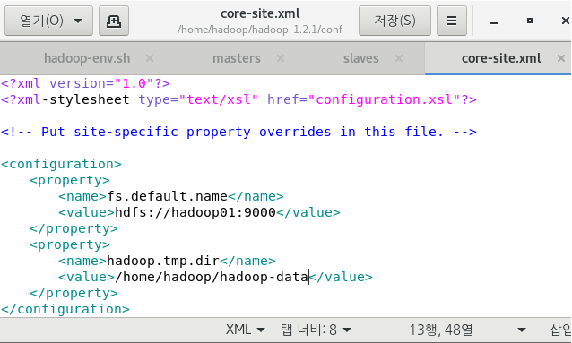

# 빅테이터 플랫폼 구축

> 실제 현업에서는 여러 대의 서버를 구축해 클러스터링 하지만 우리는 할 수 없기에 가상머신을 4대 구축해 클러스터링 한다.

## 가상머신(cent OS)

### 머신 복제 후 ip 확인

* `ifconfig`명령어를 통해 4대의 서버에 설정된 ip를 확인.
  * hadoop**01** ip : 192.168.111.129
  * hadoop**02** ip : 192.168.111.131
  * hadoop**03** ip : 192.168.111.128
  * hadoop**04** ip : 192.168.111.130

* `ssh ip주소`를 통해 다른 가상머신에 연결해보고

* `exit`을 통해 연결을 해제한다.

### 머신 4대를 클러스터링

#### 방화벽 해제

* `systemctl list-units --type=service`

  > 특정 서비스를 확인한다.

* `systemctl status firewalld`

  > 방화벽 상태 확인

* `systemctl stop firewalld`

  > 방화벽 작동 중지

  * `systemctl disable firewalld`명령으로 완벽 중지

#### hostname 변경

* `hostnamectl set-hostname (설정할 이름)`

#### DNS 설정

* etc -> hosts 파일 등록

  >192.168.111.129 hadoop01
  >192.168.111.131 hadoop02
  >192.168.111.128 hadoop03
  >192.168.111.130 hadoop04

* `/etc/init.d/network restart`

  > 네트워크 프로세스를 restart
  >
  > => ip가 아닌 도메인으로 접속하기 위해

* 설정 확인

* 4대에 모두 적용되도록 hadoop1에서 2,3,4에 직접 접속

  > !! 반드시 1에서 접속해야함

  * **`scp`** copy할 파일(위치까지 명시) copy받을 서버의 위치

    > `scp /etc/hosts root@hadoop02:/etc/hosts`

  * `ssh 서버` "실행할 명령문"

    > 원격 서버에 실행명령
    >
    > `ssh hadoop04 "/etc/init.d/network restart"`

* 암호화된 통신을 위해서 공개키 생성 후 배포

  * `su hadoop`

    > hadoop계정으로 변경
    >
    > `su -` : root계정 홈 디렉토리

  * `ssh-keygen -t rsa`

    > ssh 키 생성 명령어

  * `ssh-copy-id -i id_rsa.pub hadoop@hadoop02`

    > 생성된 공개키 배포

## 프로그램 설치

### JDK

> www.oracle.com 에서 8u231 linux x64 rpm 다운

* STS의 Remote Systems를 이용해 옮기거나 직접 드래그해서 옮길 수 있다.

* `rpm -Uvh 설치할파일이름.rpm`

  > 위 명령어를 통해 rpm파일 설치가 가능하다
  >
  > **U** : 원래 있던 게 있으면 **upgrade**하겠다는 옵션
  >
  > **v** : 설치과정을 보겠다는 옵션 (**view**)
  >
  > **h** : 설치진행과정을 특수문자 "#"으로 표시한다.
  >
  > [기타 옵션 참고](https://itdexter.tistory.com/303)

* 4대의 가상머신 홈 경로에 모두 복사해서 설치해준다

### Hadoop

> apache.org 에서 hadoop-1.2.1.tar.gz 61M 다운

* root 계정에서 hadoop 계정의 홈(/home/hadoop/)으로 파일 복사

* `tar -zxvf 압축을 풀 파일 이름.tar.gz`

  > 위 명령어를 통해 압축파일을 푼다.
  >
  > ex) `tar -zxvf hadoop-1.2.1.tar.gz`
  >
  > 옵션은 [여기](https://blog.naver.com/heaves1/220511958801) 참고

* tar.gz 파일을 나머지 머신 3대에 복사

* 압축이 풀어진 폴더에 들어가보면 conf, bin, jar파일 등 실행에 필요한 다양한 파일이 있는 걸 볼 수 있다.

#### 설정 파일

> 시작하기 전에 hadoop 계정에 `mkdir`을 통해 hadoop-data 폴더 생성

* hadoop-env.sh

  > java를 설치한 경로로 JAVA_HOME 설정

* masters

  > secondary nameNode로 사용할 hadoop02를 등록

* slaves

  > dataNode와 taskTracker로 사용될 hadoop02, hadoop03, hadoop04를 등록

* core-site.xml

  > 다른 프로그램으로 열기 눌러서 gedit를 선택
  >
  > property를 등록한다.

  

* hdfs-site.xml

  > hdfs에 저장될 데이터의 복제본 개수 (dataNode의 개수)
  >
  > nameNode용 웹서버의 주소값 완전분산모드이면 반드시 설정
  >
  > 보조 네임노드(secondary nameNode)용 웹서버의 주소값

* Mapred-site.xml

  > 데이터노드에서 정의한 주소로 맵리듀스 작업을 요청

* 모든 서버에 위 설정 파일 복사

  > `/home/hadoop/hadoop-1.2.1/conf/*` 을
  >
  > ->` /home/hadoop/hadoop-1.2.1/conf/` 로

* 네임노드 포맷

  > `/home/hadoop/hadoop-1.2.1/bin/hadoop namenode -format`

## Hadoop 실행

* `start-all.sh`

  > 클러스터링 된 4대의 가상머신을 각 역할로 실행

* `stop-sll.sh`

  > 서버 중지

* `hadoop01:50070`

  > 하둡의 관리자 페이지

