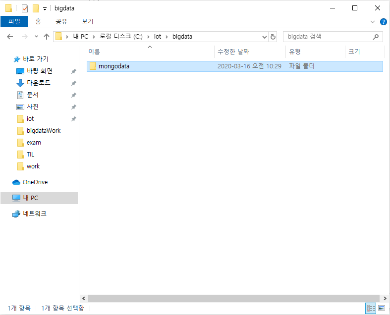
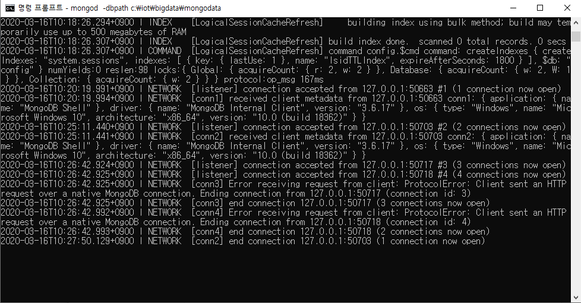

# MongoDB

> 자바스크립트 기반의 비동기방식 데이터베이스

* 특징

  * NoSql 방식 : **N**ot **O**nly **Sql**
  * 비정형 데이터(스키마가 없다.)
  * json으로 데이터 처리 
  * ex)
    * 기업 설문

* [doc](https://docs.mongodb.com/v3.6/) 참조

  > 하둡의 맵리듀스 방식과 비슷한 Sharding이나 설치법, 기본구조 설명 등 자세한 설명을 확인할 수 있다.

## 설치 및 실행

> mongoDB 홈페이지에서 Enterprise버전을 다운

* 환경변수 Path에 MongoDB bin 경로 추가

* `mongod`명령을 이용해 실행가능하다.

  * 이때 서버 경로를 설정해주지 않으면 에러가 발생하기 때문에 경로 설정 필요

    

* 설정 후 `mongod -dbpath c:\iot\bigdata\mongodata`로 실행

* 다른 cmd창으로 띄워 `mongo`명령으로 클라이언트 접속이 가능하다.

  

* `show dbs;`로 db의 정보 확인 가능

  > `show collections`(= `select * from tab;`)로 응용 가능

## 용어

* collection (rdbms에서 테이블)

  > 관계형 데이터베이스처럼 스키마를 정의하지 않는다.

  * 종류

    * capped collection

      : 고정 사이즈를 주고 생성하는 컬렉션 ex) log 정보

      미리 지정한 저장공간이 모두 사용되면 맨 처음에 저장된 데이터가 삭제되고 공간으로 활용

    * non capped collection

      : 일반적인 컬렉션

  * 생성

    * `db.createCollection("컬렉션명")` 

      **=>** 일반 collection

    * `db.createCollection("컬렉션명", {옵션 list})`

      **=>** 각각의 옵션을 설정해서 작업 (json)

  * 삭제

    * `db.collection명.drop();`

  * 컬렉션명 변경

    * `db.collection명.renameCollection("변경할컬렉션명");`

* document (레코드)

* field (컬럼)

* _id (기본키) 

  * **반드시 들어가야 함**

## 명령

> [document](https://docs.mongodb.com/v3.6/reference/method/)

* `use mydb`

  : "mydb"라는 이름의 db로 접속 (= conn mydb/mydb)

* `db.stats()`

  : 현재 db의 정보를 보여줌

* `db.logout()`

  : 현재 db에서 로그아웃

## CRUD

* mongoDB에 `insert`

  > db.컬렉션명.insert({데이터...})
  >
  > db.컬렉션명.insertOne({데이터...})
  >
  > db.컬렉션명.insertMany({데이터...})

  * document에 대한 정보는 json의 형식으로 작성

  * mongodb에서 document를 삽입하면 자동으로 _id가 생성 - 기본키의 역할

    ```markdown
    "_id" : ObjectId("5e6ee81470642ecd7a6a29aa")
    				----------------------------
    				현재 timestamp + machine Id + mongodb프로세스id 
    				+ 순차번호
    				  -------
    				  추가될 때마다 증가
    ```

* update

  * update를 위한 명령어

    * $set 

      : 해당 필드의 값을 변경 (업데이트를 하기 위한 명령어)

      none capped collection인 경우 업데이트할 필드가 없는 경우, 추가한다.

      > db.컬렉션명.update({조건필드: 값}, //sql의 update문 where절
      >
      > ​									{$set: {수정할필드: 수정값}, //set절
      >
      > ​                                    {update와 관련된 옵션: 옵션값});

    * $inc : 해당필드에 저장된 숫자의 값을 증가

    * $unset : 원하는 필드를 삭제할 수 있다.

    * 옵션

      * multi 

        : true를 추가하지 않으면 조건에 만족하는 document 중 첫 번째 document만 update

  * document 수정

  * 조건을 적용해서 수정하기 위한 코드도 json으로 구현

### 배열

* 배열에서 사용할 수 있는 명령어

  * $addToSet : 배열의 요소를 **1개** 추가

    > 없는 경우에만 값을 추가, **중복을 체크**

  * $push : 배열의 요소를 **1개** 추가

    > **중복을 허용**

  * $pop : 배열의 요소를 제거

    * 1 : 마지막 요소를 제거
    * -1 : 첫 번째 요소를 제거

  * $each 

    : addToSet이나 Push에서 사용할 수 있다.

    **여러 개**를 배열에 추가할 때 사용

    > `db.score.update({id:"jang"},{$push:{"info.city":{$each:["천안","가평","군산"]}}});`

  * $sort : 정렬 

    * 1 : 오름차순
    * -1 : 내림차순

    > `db.score.update({id:"jang"},{$push:{"info.city":{$each:["천안","가평","군산"],$sort:1}}});`

  * $pull : 배열에서 조건에 만족하는 요소를 제거 

    * 단, 조건은 오직 **1개**

    >`db.score.update({id:"jang"},{$pull:{"info.city":"천안"}});`

  * $pullAll : 배열에서 조건에 만족하는 요소 제거

    * 조건 **여러 개**

    >`db.score.update({id:"jang"},{$pullAll:{"info.city":["천안","군산"]}});`

