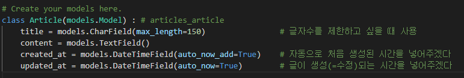
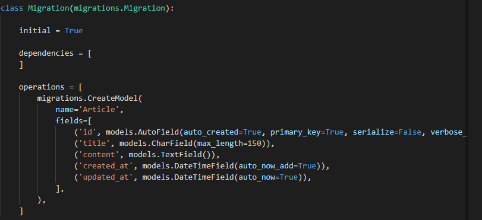

# Django DB 연동

> Django와 SQLite를 사용하여 DB를 연동하자

## model

> DB의 데이터를 담기 위한 객체를 정의하는 곳

* 모델로 사용할 클래스 객체를 정의한다.

  

* 모델생성하기

  ```bash
  python manage.py makemigrations
  ```

  => 내가 정의한 모델로 설계도를 만드는 명령

  

* 실제 DB에 스키마를 가진 테이블 생성

  ```bash
  python manage.py migrate articles
  ```

## ORM

* shell 창으로 이동

  ```bash
  python manage.py shell
  ```

### create

```sqlite
insert into table(column1, column2, ...)
			values(values1, values2, ...) 
```

#### record를 생성(추가)하는 방법

1. ```python
   article = Article()
   article.title = 'first'
   article.content = 'django!'
   article.save()	# DB에 저장
   ```

2. ```python
   article = Article(title='second', content='django!')
   article.save()
   ```

3. ```python
   Article.objects.create(title='third', content='django!')
   # save() 없이 저장이 가능하다.
   ```

### read

```sqlite
select * from articles_article
```

#### record를 읽는 방법

1. ```python
   article = Article.objects.all()
   article
   ```

2. ```python
   Article.objects.filter(title='first')
   # 'first'라는 이름을 가진 애 중에 첫번째
   Article.objects.filter(title='first').first()
   # 'first'라는 이름을 가진 애 중에 마지막번째
   Article.objects.filter(title='first').last()
   # 'first'라는 이름을 가진 애 인덱스로 접근
   Article.objects.filter(title='first')[0]
   ```

3. ```python
   Article.objects.get(id=1)	# ==
   Article.objects.get(pk=1)	# ==
   # 주의!
   # 고유값이 아닌 내용을 필터링해서 2개 이상의 값이 찾아지면 오류를 발생시킨다.
   # 없는 것을 가지고 오려고 해도 오류 발생
   ```

4. ```markdown
   ** like / startswith / endswith **
   ```

   ```python
   # 특정 문자열 포함
   Article.objects.filter(title__contains='fir')
   # 특정 문자열로 시작
   Article.objects.filter(title__startswith='se')
   # 특정 문자열로 끝
   Article.objects.filter(title__endswith='ha')
   ```

* 매직 메서드

  > java의 `toString()`과 같은 역할을 하는 메서드

  ```python
  def __str__(self) :
          return f'{self.id}번째 글 - {self.title} : {self.content}'
  ```

### update

```sqlite
update articles_article set title='byebye' where id=1
```

#### record 수정하기

1. ```python
   article = Article.objects.get(pk=1)
   article.title = 'byebye'
   article.save()
   ```

### delete

```sqlite
delete from articles_article where id=1
```

#### record 삭제하기

1. ```python
   article = Article.objects.get(pk=1)
   article.delete()
   # 자동으로 저장이 되기 때문에 save()가 필요없음
   ```