# Django DB 활용

## ForeignKey

* `models.py`

  

  > Article을 참조하는 Comment 테이블을 정의하고 models의 ForeignKey로 외래키를 정의해준다. 
  >
  > **to**와 **on_delete**는 필수로 정의해주어야 하는 속성이다.

  * to

    : 참조할 테이블, 즉 클래스 명을 입력

  * on_delete

    : 참조한 컬럼이 삭제된 경우 같이 삭제할 것인지 아닌지 정하는 속성

    (CASCADE는 같이 삭제한다는 속성)

  * related_name

    : 역참조 값. 참조한 테이블에서 나를 불러올 때 사용할 수 있는 키값

    주로 N:N 관계일 때 사용한다. 1:N 관계일 때는 잘 사용하지 않음.

## django 확장 툴

>bash 창에 이 명령을 사용해 확장 툴을 설치한다.

```bash
pip install django-extensions
```

* `settings.py`

  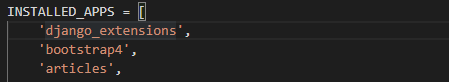

  ```markdown
  bootstrap4처럼 등록 후 사용해야 한다.
  ** 주의!! **
  설치는 `-`으로 등록은 `_`로 해야 함
  ```

* 새로운 shell 창 열기

  ```bash
  python manage.py shell_plus
  ```

* ipython 설치

  ```bash
  pip install ipython
  ```

## 사용 예

* `views.py`

  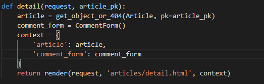

  ```markdown
  댓글을 생성하기 위한 CommentForm을 생성해준다
  ```

* `detail.html`

  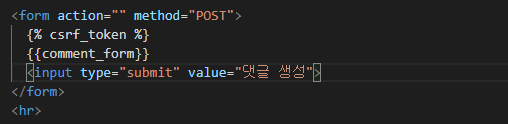

  ```markdown
  댓글을 생성하기 위한 form태그를 만든다
  **주의!!**
  하지만 이렇게 되면 article 선택란이 생겨 의도와 다른 형태의 form이 만들어진다.
  ```

  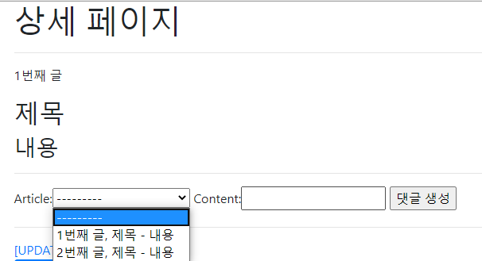

* `forms.py`

  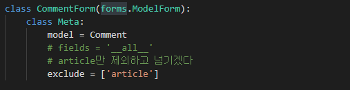

  ```markdown
  exclude로 article만 제외하고 모든 칼럼을 정의하는 방식으로 바뀌어야 한다.
  ```

  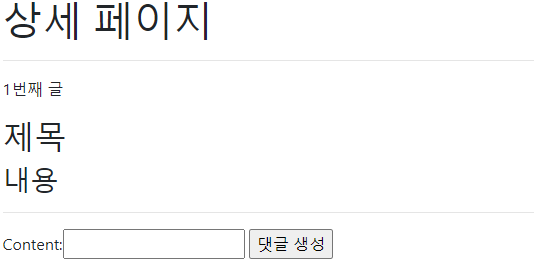

### 댓글 등록

* `views.py`

  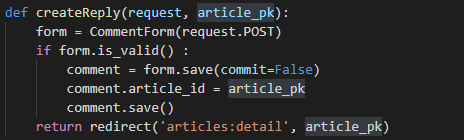

  ```markdown
  일반적으로 DB에 insert하는 방식과 달리 fk가 존재할 경우 해당 키를 적용한 후 커밋을 해주어야 한다.
  commit 속성을 False로 주어 DB에 저장을 방지하고 return된 객체에 article_id를 지정해준 뒤 save()하는 방식으로 DB insert를 진행해야 한다.
  ```

### 댓글 조회

* `views.py`

  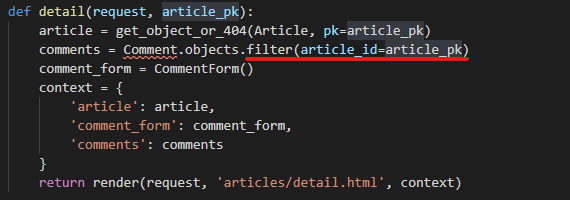

  ```markdown
  댓글이 여러 개 존재할 수 있기 때문에 filter를 이용해 레코드를 불러온다.
  ```

* `html`

  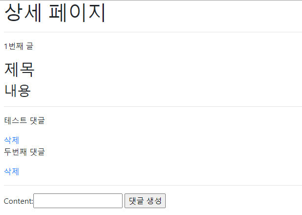

### 댓글 삭제

* `views.py`

  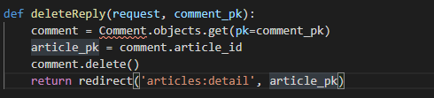

  ```markdown
  삭제를 진행하는 방법은 이전과 같지만 detail페이지로 redirect하기 위해 위와 같은 방법으로 삭제를 진행한다.
  ```

* 결과

  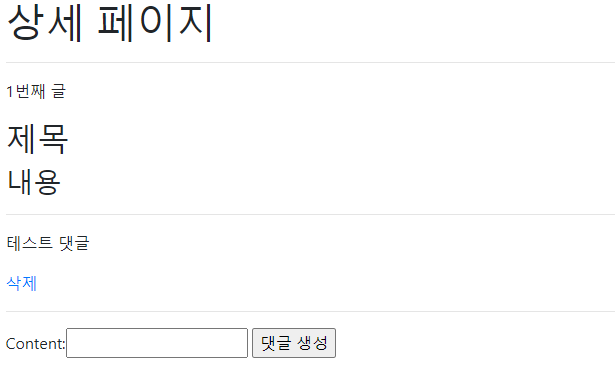


