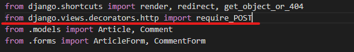
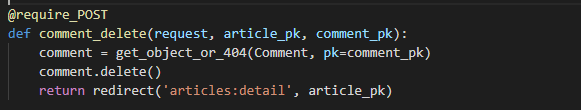

# Django relation 1:N

## create

```python
# 1. 댓글 생성
comment = Comment()
comment.content = '첫번째 댓글'
comment.save()
```

> 이렇게만 작성하면 오류가 발생한다 comment의 **`article`**이 정의되지 않았기 때문

```python
# 2. 게시글 하나 불러오기
article = Article.objects.get(pk=1)

# 2.1 comment와 article 연결하기
comment.article = article
comment.save()
```

> 이렇게 작성해야 오류없이 `save`가 가능하다

```python
# 또 다른 방법
# 작성하는 숫자는 article(참조할 게시글)의 pk값
comment.article_id = 1
comment.save()
```

## read

```python
# comment 변수들 불러오기

# 1. 댓글 pk 조회
comment.pk
# 2. 댓글 content 조회
comment.content
# 3. 댓글이 어느 게시글에 연결되어 있는가
# fk의 이름을 abcd로 지정하면 abcd_id로 불러올 수 있다
comment.article_id
# 4. 댓글이 연결된 게시글
comment.article
# 4-1. 댓글이 연결된 게시글의 제목과 내용
comment.article.pk
comment.article.title
comment.article.content
```

> 이렇게 조회가 가능하다.

```python
# article의 경우는 ?
article.comment_set.all()
```

> 댓글이 있는지 없는지 알 수 없기 때문에 직접 가져올 수는 없어서 **_set**을 통해 QuerySet 형태로 불러와야 한다.

## POST 간단하게 정리하기

* `@` : 데코레이터

* `require_POST`

  

  ```markdown
  django가 주는 views에서 쓸 decorators http를 위한 import
  ```

  

  ```markdown
  반드시 POST 방식일 때만 접근이 가능하도록 만들어주는 decorator
  Spring에 RequestMapping을 정의해주는 것과 비슷한 의미
  ```

  