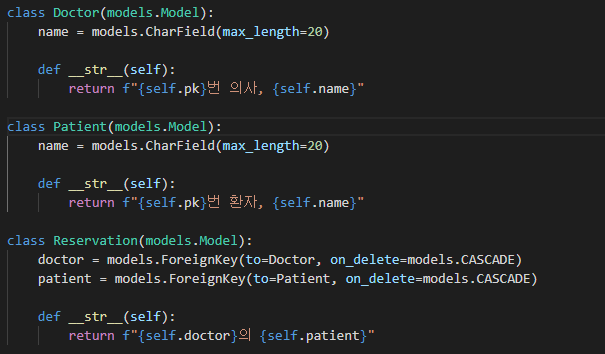
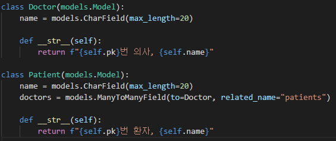

# Django relation M:N

> 서로가 서로를 여러 개 참조할 수 있다

## Reservation 클래스 사용하기

* 각 테이블의 pk를 가진 테이블을 하나 더 만든다

  

  ```markdown
  의사와 환자의 pk를 fk로 가지는 테이블을 만들어 한 의사가 여러 환자를 참조할 수 있으며 환자 또한 여러 의사를 참조할 수 있다.
  ```

* `orm`

  ```shell
  doctor = Doctor.objects.create(name='KIM')
  patient = Patient.objects.create(name='TOM')
  Reservation.objects.create(doctor=doctor, patient=patient)
  doctor.reservation_set.all()
  # 결과 값
  # <QuerySet [<Reservation: 1번 의사, KIM의 1번 환자, TOM>]>
  ```

  하지만 이렇게 작성할 경우 매번 `reservation_set.all()`을 통해 가져와야 하기 때문에 상당히 불편하다

## ManyToManyField 사용하기

* `ManyToManyField()`정의

  

  ```markdown
  둘 중 한 쪽에 ManyToManyField를 정의한다.
  ```

  * to 

    : `ManyToMany`의 관계가 될 클래스

  * related_name

    : MTM 관계를 가진 상대가 불러올 내 클래스 리스트 이름

* `orm`

  ```shell
  doctor = Doctor.objects.create(name='KIM')
  patient = Patient.objects.create(name='TOM')
  
  # add를 통해 환자를 알려준다
  doctor.patients.add(patient)
  
  # 출력 결과
  doctor.patients.all()
  
  # 관계를 지우는 방법
  doctor.patients.remove(patient)
  
  # doctor 지우기
  doctor.delete()
  # 만약 관계가 있을 경우 모든 관계와 같이 삭제된다(remove 해줄 필요 없음)
  
  ```

* 특징

  * 서로의 id 정보만 알 수 있기 때문에  특수한 상황에서는 사용할 수 없다

  * 예

    ```markdown
    * 특정한 환자가 특정 시간에 예약한 경우
    	-> 환자의 id만 알기 때문에 시간에 대한 정보를 알 수 없다
    ```

    **=>** 이 경우 **`Reservation`**클래스를 통해 필요한 field를 더 정의해 사용해야 한다.

## User 커스터 마이징 하기

