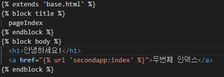

# Django

> 다용도의, 안전한, 확장성 있는, 완결성 있는, 쉬운 유지보수, 포터블한
>
> **웹 프레임워크**

* MTV

  > **M**odel : 데이터를 관리 
  >
  > **T**emplate : 중간 관리자
  >
  > **V**iew : 사용자가 보는 화면

## intro

> start Django

1. 장고 설치

   ```bash
   pip install django==2.1.15
   pip list
   ```

2. 프로젝트 생성

   ```bash
   django-admin startproject <프로젝트 명>
   ```

   ```bash
   # 서버 실행
   python manage.py runserver
   ```

3. 프로젝트 생성 시 제공하는 파일

   * manage.py
     * 전체 django와 관련된 모든 명령어를 manage.py를 통해 실행한다.
   * `__init__.py`
     * 현재 `__init__.py`파일이 존재하는 폴더를 하나의 프로젝트, 혹은 패키지로 인식하게 해주는 파일.
   * settings.py
     * 현재 프로젝트의 전체적인 설정 및 관리를 위해 존재하는 파일.
   * urls.py
     * 내 프로젝트에 접근할 수 있는 경로를 설정하기 위한 파일.
   * wsgi.py
     * 추후 배포 때 필요함.
   
4. pages

   >어플리케이션

   * models.py
     * MTV 중 모델을 관리하기 위한 파일
   * views.py
     * MTV 중 뷰를 관리하기 위한 파일, 모델을 관리한다

## mysite 기초

>`URL -> View -> Template` 의 과정을 기억하기

* urls.py를 통해 사용하고자 하는 url 정의하기

  : Spring Controller에서 mapping 시켜주는 것과 같은 행위

  

* views.py를 통해 실행될 함수 정의하기

  : Controller 메서드와 같은 역할

  

  `render`에 값을 전달할 때는 `dictionary`의 형태로 전달한다

  

  이렇게도 전송이 가능하다

  ```html
  <!-- html 내부 -->
  <h1>나는 {{name}}, 나이는 {{age}}</h1>
  ```

* 어플리케이션 경로에 templates 폴더 생성 후 그 안에 html 파일 작성

  

* 해당 url로 결과 페이지 확인

  

  ```html
  <!-- html 내부에는 이렇게 작성되어 있다 -->
  <h1>오늘 점심 메뉴는 ? {{pick}}</h1>
  ```

## mysite 요청 값 넘겨주기

* `urls`에서 받을 매개변수 지정해주기

  

* `views`에서 함수 작성하기

  

* 결과 확인하기

  

* 다른 자료형 또한 받을 수 있다

  ```python
  path('multiple/<int:num1>/<int:num2>', views.multiple)
  ```

  

* html에서 `for`문을 이용해 `list`데이터에 접근할 수 있다

  

  

  

* 문자열 필터

  * 실행 조건

  

  * 실행 결과

  

## GET

> 주로 조회할 때 사용하는 요청 방식

* 정보를 보내는 페이지

  

* `urls.py`

  

* `views.py`

  

  ```python
  request.GET.get('message')	# 해당 값이 없어도 상관없음
  request.GET['message']		# 해당 값이 없으면 오류 발생
  ```

  * GET으로 받은 값이 `dictionary`와 **완전히 같은** 형식일까?

* `catch.html`

  

```markdown
이렇게 페이지끼리 값을 주고 받을 수 있다.
```

## POST

> DB 구조가 보이면 안되는 등록이나 수정 작업을 할 때 사용하는 방식

* 보내는 페이지

  

  **csrf_token**을 통해 사이트 간 요청 위조 작업을 진행한다. 이것이 가능한 이유는 `settings.py`에 관련 내용이 정의되어 있기 때문이다.

  

* `urls.py`

  

* `views.py`

  

  이렇게 **POST**방식으로 데이터를 전송받을 수 있다. 작업이 완료된 후 원래 페이지로 돌아가게 `redirect`작업을 진행해준다.

* 수정한 결과

  

## 여러 개의 어플리케이션 만들기

> app 생성 명령으로 새로운 앱을 만든다.

```bash
python manage.py startapp secondapp
```

* `mysite`의 `urls.py`에 `views`를 정의하려고 하면 에러가 발생한다.

  ```python
  from pages import views			# 이름이 같아서
  from secondapp import views		# 에러가 발생한다.
  
  urlpatterns = [
      path('throw/', views.throw),
      path('index/', views.index),
  ]
  ```

  누구의 `views`를 불러와야 하는지 알 수가 없다.

* `urls.py`분리하기

  \

  이제 어플리케이션 별로 `urls.py`를 작성해서 사용할 것이다.

* 새로 생성한 `urls.py`에 내용도 `mysite`에 있는 `urls.py`처럼 정의한다.

  

* `mysite`의 `urls.py`에 이 경로를 정의해준다.

  

  > 이제 각 앱이 가진 `urls.py`를 통해 접근할 수 있다.

* 이때 같은 이름의 `path`가 존재한다면 `urls.py`에서 제일 상위에 정의된 어플리케이션의 **templates** 경로를 찾아 그 안의 `html`파일로만 적용이 된다.

  * ex) 

    ```markdown
    * 127.0.0.1:8000/secondapp/index
    * 127.0.0.1:8000/pages/index
    ```

    

    각자 맞는 페이지에 접근하게 하기 위해 **templates** 폴더 안에 각 앱의 이름으로 된 폴더를 정의해 그 안으로 `html`파일을 이동시킨다.

    

    이제 **`127.0.0.1:8000/pages/index`**의 형식으로 접근이 가능하다.

* 이제 다른 `html`페이지 **내**에서 `pages`나 `secondapp`에 있는 페이지에 접근하려면 **`name`**속성을 정의해서 접근해야 한다.

  

  * 만약 `name`속성까지 같은 페이지가 있다면 ?

    > 어떤 `app`의 `name`인지 구분이 필요

    

    

    이런 방법으로 **어떤 app의 어떤 name**인지 구분해서 접근할 수 있다.

## 기본 html 페이지 작성하기

* `mysite`의 `settings.py`에 기본 `html`을 가져올 곳의 프로젝트와 경로를 정의

  

  실제로 이 위치에 있다.

  

  `base.html`의 내용은 다음과 같다.

  

* 다른 페이지에서 사용할 때 **DTL**을 이용해 접근할 수 있다.

  

## static 폴더 사용하기

> image나 css 등 spring에서 사용한 것처럼 정적 폴더를 이용한 경로로 해당 파일에 접근할 수 있다.

* `static`폴더를 정의한다.

  

  * `settings.py`의 내용때문에 이런 일이 가능하다.

    

* `static`폴더에 있는 `image`를 사용해보자

  

  


