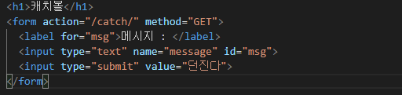

# Django

> 다용도의, 안전한, 확장성 있는, 완결성 있는, 쉬운 유지보수, 포터블한
>
> **웹 프레임워크**

* MTV

  > **M**odel : 데이터를 관리 
  >
  > **T**emplate : 중간 관리자
  >
  > **V**iew : 사용자가 보는 화면

## intro

> start Django

1. 장고 설치

   ```bash
   pip install django==2.1.15
   pip list
   ```

2. 프로젝트 생성

   ```bash
   django-admin startproject <프로젝트 명>
   ```

   ```bash
   # 서버 실행
   python manage.py runserver
   ```

3. 프로젝트 생성 시 제공하는 파일

   * manage.py
     * 전체 django와 관련된 모든 명령어를 manage.py를 통해 실행한다.
   * `__init__.py`
     * 현재 `__init__.py`파일이 존재하는 폴더를 하나의 프로젝트, 혹은 패키지로 인식하게 해주는 파일.
   * settings.py
     * 현재 프로젝트의 전체적인 설정 및 관리를 위해 존재하는 파일.
   * urls.py
     * 내 프로젝트에 접근할 수 있는 경로를 설정하기 위한 파일.
   * wsgi.py
     * 추후 배포 때 필요함.
   
4. pages

   >어플리케이션

   * models.py
     * MTV 중 모델을 관리하기 위한 파일
   * views.py
     * MTV 중 뷰를 관리하기 위한 파일, 모델을 관리한다

## mysite 기초

>`URL -> View -> Template` 의 과정을 기억하기

* urls.py를 통해 사용하고자 하는 url 정의하기

  : Spring Controller에서 mapping 시켜주는 것과 같은 행위

  

* views.py를 통해 실행될 함수 정의하기

  : Controller 메서드와 같은 역할

  

  `render`에 값을 전달할 때는 `dictionary`의 형태로 전달한다

  

  이렇게도 전송이 가능하다

  ```html
  <!-- html 내부 -->
  <h1>나는 {{name}}, 나이는 {{age}}</h1>
  ```

* 어플리케이션 경로에 templates 폴더 생성 후 그 안에 html 파일 작성

  

* 해당 url로 결과 페이지 확인

  

  ```html
  <!-- html 내부에는 이렇게 작성되어 있다 -->
  <h1>오늘 점심 메뉴는 ? {{pick}}</h1>
  ```

## mysite 요청 값 넘겨주기

* `urls`에서 받을 매개변수 지정해주기

  

* `views`에서 함수 작성하기

  

* 결과 확인하기

  

* 다른 자료형 또한 받을 수 있다

  ```python
  path('multiple/<int:num1>/<int:num2>', views.multiple)
  ```

  

* html에서 `for`문을 이용해 `list`데이터에 접근할 수 있다

  

  

  

* 문자열 필터

  * 실행 조건

  

  * 실행 결과

  

## GET

> 주로 조회할 때 사용하는 요청 방식

* 정보를 보내는 페이지

  

* `urls.py`

  

* `views.py`

  

  ```python
  request.GET.get('message')	# 해당 값이 없어도 상관없음
  request.GET['message']		# 해당 값이 없으면 오류 발생
  ```

* `catch.html`

  

```markdown
이렇게 페이지끼리 값을 주고 받을 수 있다.
```


