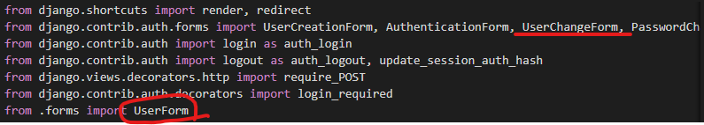
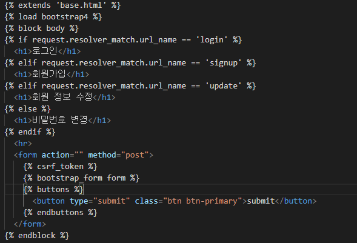

# accounts

> 장고에서 제공하는 회원관리 기능을 가진 앱

## 회원 가입

* `UserCreationForm()`

  : 장고가 제공하는 User 생성 폼

  

  > 상속을 받아 사용할 수 있다. 자세한 정보는 [django-github](https://github.com/django/django/blob/6e5041f57c/django/contrib/auth/forms.py)에서 확인할 수있다.

* `html`에서 사용 예

  

  > 기본으로 제공하는 `form`의 모양이다

## 로그인

* `AuthenticationForm()`

  

  > 장고에서 제공하는 로그인 기능을 가진 `form`

  ```markdown
  * login
  	: 유저의 정보를 확인해 로그인하기 위해 import한 메서드
  	이름이 같기 때문에 이름을 auth_login으로 변경했다.
  ```

* `views.py`

  

  > auth_login을 통해 유저의 정보를 알고 있는 **`request`**와  유저의 정보(아이디, 비밀번호)를 **`get_user()`**로 가져와 함께 넘겨준다.

## 로그아웃

* `views.py`

  

  ```markdown
  로그인처럼 logout메서드를 import 해준 뒤 이름이 겹치지 않게 변경하는 작업 진행
  ```

  

  ```markdown
  auth_logout메서드를 통해 간단하게 로그아웃을 할 수 있다.
  ```

## 회원 탈퇴

* `views.py`

  

* `@login_required`

  ```markdown
  장고에서 제공하는 decorator로 require_POST처럼 로그인을 했을 때만 접근할 수 있는 메서드에 사용한다.
  ```

## 회원 정보 수정

* `forms.py`

  

  ```markdown
  * 회원 정보를 수정하기 위해서는 UserChangeForm을 사용해야 함
  	=> 그냥 사용하면 불필요한 정보까지 보이기 때문에 상속 후 재정의를 해야 한다.
  * UserForm을 정의해 수정이 필요한 field만 정의해 사용한다.
  ```

* `views.py`

  

  

  ```markdown
  이렇게 import한 후 위 방식으로 회원 정보를 수정할 수 있다.
  ```

## 비밀번호 변경

> 장고에서 제공하는 비밀번호 변경 form을 사용해 작성한다.
>
> 장고에서 제공하는 회원 model의 비밀번호는 암호화 처리가 되어 있기 때문에 쉽게 접근 이 불가능하다.

* `views.py`

  

  ```markdown\
  form은 비밀번호 수정을 위해 장고가 제공하는 형식
  update_session_auth_hash는 비밀번호 변경 후 로그인이 되게 하는 메서드
  ```

  

## html 통합

* `form.html`

  

  ```markdown
  request의 resolver_match.url_name을 통해 비슷한 형식을 가진 form을 통합해 사용할 수 있다.
  ```

  


