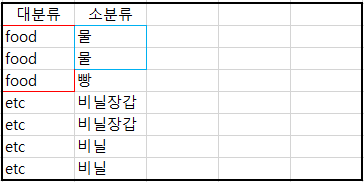

# SQL

## 제약 조건

> 테이블 생성 시 들어갈 값에 제약을 걸 수 있다.
>
> 생성 시 추가하지 못한 제약조건을 alter명령을 통해 수정할 수 있다.

```sql
alter table member add constraint mem_ssn_uni unique(ssn);
-- 제약조건을 거는 명령어
alter table member drop constraint member_ck;
-- 제약조건을 제거하는 명령어
```

* Not Null

> 컬럼값이 공백이 되면 안된다는 조건
>
> 수정하면서 추가할 수 없는 제약 조건이다.

* Unique

> 값이 중복되면 안된다는 조건

* **P**rimary **K**ey(PK)

> 기본키, 중복없이 단 하나만 있어야 하는 키를 말한다.
>
> **Not Null**과 **Unique** 특성을 모두 가진다.
>
> ChildTable이 존재하면 ParentTable을 삭제할 수 없다.


PK를 가지고 있는 테이블을 **ParentTable**이라고 부른다.

* **F**oreign **K**ey

> 외래키, 다른 테이블에 설정된 기본키를 참조해 사용할 때 외래키라고 부른다.
>
> Primary key에 없는 값은 당연히 쓸 수 없다.


FK를 가지고 있는 테이블을 **ChildTable**이라고 부른다.

```sql
Alter table 테이블명
Add constraint 제약조건명 foreign key(foreign key제약조건을적용할컬럼)
			   references 테이블명(기본키–foreign key에서참조할기본키)
--------------------------------------------------------------------
alter table member
add constraint mem_decode_fk foreign key(deptcode)
               references mydept(code);
```

* 정규화

> 관계형 데이터베이스의 설계에서 중복을 최소화하게 데이터를 구조화하는 과정을 말한다. 위의 두 표를 예로 볼 수 있다.

* Check

> 컬럼에 입력되는 값에 제약을 두는 조건

```sql
alter table member
add constraint member_ck check(addr in ('인천', '서울', '경기'));
-- addr에는 인천, 서울, 경기만 올 수 있게 check 제약조건을 걸었다
```

**※** 테이블을 지우면 관련된 모든 제약조건들이 삭제된다.

## SQL-Plus 명령어

```sql
conn system/manager
-- 접속 / 아이디 / 패스워드
cl scr
-- 지금까지 사용했던 명령, 화면 다 지워짐
set linesize 300;
-- 설정한다 / 한 라인에 보여지는 글자 수 / 글자 개수
desc customer;
-- customer라는 이름의 테이블 정보를 보여줌
set pagesize 200;
-- 조회 결과가 보여지는 크기 조절
```

## SQL Query

> DB에 원하는 작업을 수행할 수 있도록 하는 명령언어

* **;**을 만나기 전까지는 명령으로 인식하기 때문에 Enter를 입력해도 명령이 끝나지 않음. => 여러 줄로 sql문을 작성할 수 있다.

* 대소문자를 구분하지 않는다.

* *****은 모든 컬럼을 조회하겠다는 의미

* 컬럼에 null을 저장할 수 있다.

* **null**은 **0**이나 space만 입력해놓은 값과 **다른 값**

  사용할 수 없고 저장되지 않은 값

* 컬럼명 대신 **alias(별명)**를 정의해서 사용할 수 있다.

```sql
select ename 사원명, hiredate as 입사일, sal "나의 급여" from emp;
-- 공백이 있는 문자열은 반드시 ""를 사용해 묶어줘야 한다.
```

* 여러 컬럼을 합쳐서 하나의 컬럼명으로 조회할 수 있다. `||`연산자 이용

```sql
select ename || '의 급여는 ' || sal || '입니다.' from emp;
```

* 오라클의 문자열, 날짜 데이터는 `' '`로 표현한다.

* 연산의 결과로 컬럼을 생성할 수 있다. (+, *, /, -, 함수...)

  단 null이 포함되어 있는 컬럼은 연산할 수 없다.

  ```sql
  select ename, sal, comm, sal+comm 급여합 from emp;
  ```

* 중복이 있는 경우 중복을 제거하고 출력하기 위해 select문에 distinct를 추가할 수 있다.

```sql
select distinct job from emp;
```

위 예시는 emp라는 테이블에 job이 몇 종류 있는지 알아보기 위해 사용했다.

### DDL

> **테이블**을 생성(정의), 삭제, 수정하는 명령

#### CREATE

> 데이터베이스나 **테이블을 생성**하는 명령어

```sql
create user java identified by java;
-- 생성한다 / 유저를 / 이름이 java인 / 식별된 / 패스워드가 java로
create table test(
    id varchar2(10) primary key,
    pass varchar2(15) not null,
	name varchar2(10),
    deptcode varchar2(10),
	constraint fk_code foreign key(deptcode)
	references mydept(code));
-- test 테이블 생성(컬럼 데이터형(글자수) 제약조건);
```

#### DROP

> 데이터베이스나 테이블 등을 **삭제**하는 명령어

```sql
drop database testdelete;
-- 삭제한다 / database를 / 이름이 testdelete인
drop table customer;
-- customer 테이블을 삭제한다
```

#### ALTER

> 데이터베이스나 테이블 등의 구성을 **변경**하는 명령어

```sql
alter user java identified by java123;
-- 수정한다 / 유저를 / 이름이 java인 / 식별된 / 패스워드가 java123으로
alter user hr account unlock;
-- hr 계정 잠금 해제
alter session set nls_language='american';
-- sql 세션 변경
alter table member add (tel varchar2(15), info varchar2(10));
-- 컬럼을 기존 테이블에 더한다
alter table member modify (tel char(11));
-- 컬럼의 자료형을 수정한다
alter table member drop column info;
-- 기존 테이블의 컬럼을 드랍한다
alter table member rename column addr to address;
-- 테이블의 컬럼 이름을 수정한다
alter table member add constraint mem_ssn_uni unique(ssn);
-- 멤버 테이블 ssn컬럼에 unique 제약 조건을 mem_ssn_uni라는 이름으로 추가한다
```

### DML

> 테이블의 **데이터**를 **조작**하는 명령문
>
> 반드시 작업이 완료된 후 **commit** 명령문을 실행해야 저장이 됨

#### SELECT

> 테이블에서 행을 **검색**하는 명령어

```sql
select * from tab;
-- 선택한다 / 전부를 / tab에서
select user from dual;
-- 현재 접속 계정 출력 명령어

select 컬럼명 alias명;
select 컬럼명 as alias명;
select 컬럼명 "alias명";	-- 중간에 공백이 있는 경우 ""로 묶어줘야 함 
-- 별명으로 조회하는 명령
```

#### UPDATE

> 테이블 데이터를 수정하는 명령어

```sql
update emp set deptno=20, sal=1300 where empno=7777;
-- ↓ sub query도 사용할 수 있다.
update member set addr=(select addr from member where id = 'jang');
where id = 'lee';
```

* 복수열 갱신

```sql
update member set addr = (select addr from member where id = 'jang'),
				  pass = (select pass from member where id = 'jang');
```

#### INSERT

> 테이블에 신규 행을 **추가**하는 명령어

```sql
insert into Department values ('001', '전산', '7', '02-111-2222');
-- 삽입한다 / Department 테이블에 / ()안 정보를 가진 행을
insert into emp(empno, ename, hiredate) values (7777, '장동건', sysdate);
insert into member values ('jjang',null,null);
```

* 복수 행 insert

```sql
insert all into member values ('lee', '1234', '인천')
           into member values ('kang', '1234', '안산')
           into member values ('hong', '1234', '수원')
select * from dual;
```

#### DELETE

> 테이블 삭제 or 행을 **삭제**하는 명령어

```sql
delete member;
delete from member;
delete from member where id = 'jjang';
delete from member where id = 'jjang';
-- ↓ sub query도 사용할 수 있다.
delete from member where addr=(select addr from member where id = 'jang');
```

### DCL

#### COMMIT

> 데이터베이스 변경 내용을 **확정**하는 명령어

```sql
commit;
```

#### ROLLBACK

> 데이터베이스 변경 내용을 **취소**하는 명령어

```sql
rollback;
```

#### GRANT 

> 사용자에게 처리 **권한을 부여**하는 명령어

```sql
grant connect,resource to scott;
-- 권한을 부여 / connect와 resource / scott에게
grant create view to scott;
-- view를 만들 수 있는 권한을 scott 계정에 줌
```

#### REVOKE

> 사용자 처리 권한을 제거하는 명령어

### 조건

#### WHERE

> 테이블 내에 있는 모든 행을 조건에 따라 검사한다.
>
> select 절 사용시 위 명령을 통해 조건을 추가한다.

* * 검색 결과를 제한 (조건에 만족하는 데이터만 조회)
  * **from절 다음**에 정의
  * **조건식이 true**가 되도록 정의
  * 비교연산자: `<, <=, >, >=, =, **<>(!= 와 같은 의미)**, !=
  * 비교하는 값이 문자나 날짜일 경우 **' '** 사용
  * 비교하는 값은 **정확하게 대소문자를 구분**해줘야 한다.

```sql
select ename,job,hiredate,sal from emp where job='MANAGER';
```

##### AND, OR, IN 연산자

> **두 개 이상의 조건**이 있는 경우 사용할 수 있는 연산자

* AND

  : **모든 조건**이 일치

* OR

  : 모든 조건 중 **한 개만 일치** (조건이 모두 다른 컬럼인 경우)

```sql
select * from emp where deptno = 10 or sal >= 2000;
```

* IN

  : or 연산자의 의미와 동일

   컬럼명 in (비교할 값, 값, ...)

   **같은 컬럼**에서 **값**을 **여러 개 비교**해야 하는 경우

```sql
select ename,job,deptno from emp where job in ('MANAGER', 'PRESIDENT');
```

* NOT 

  : 부정

```sql
select ename,job,deptno from emp where job not in ('MANAGER', 'PRESIDENT');
```

##### null값에 대한 비교

* IS NULL

  : null인 데이터를 조회

```sql
select ename, sal, comm from emp where comm is null;
```

* IS NOT NULL

  : null이 아닌 데이터를 조회

```sql
select ename, sal, comm from emp where comm is not null;
```

**※ null과 0은 다르다**

##### LIKE

> 대표문자와 함께 사용
>
> 조건비교를 위해 **입력한 값**이 **문자열에 포함**되어 있는 것을 찾는 경우

* % : 모든 문자열

```sql
select ename,sal,comm from emp where ename like 'A%';
-- ename이 A로 시작하는 모든 문자열 select
select ename,sal,comm from emp where ename like '%A%';
-- ename에 A가 어디에 위치하든 중간에 하나라도 있는 모든 문자열 select
```

* _ : 한 자리 문자를 의미

```sql
select ename,sal,comm from emp where ename like '_A%';
-- ename의 두 번째 문자가 A인 모든 문자열 select
```

##### BETWEEN

> 같은 컬럼에서 사이 조건을 비교하는 경우
>
> BETWEEN a AND b 형식으로 사용

```sql
select ename,sal from emp where sal between 2000 and 5000;
```

### 정렬

#### ORDER BY

> ORDER BY 컬럼명 정렬기준(asc, desc)

* 기본은 오름차순이다.

* WHERE 절 다음에 위치한다

##### 오름차순(asc)

> 작 -> 큰 
>
> ex) 1, 2, 3, 4, 5, ...  / ㄱ, ㄴ, ㄷ, ㄹ, ....

```sql
select ename, sal, job from emp order by sal; -- asc 생략가능
```

##### 내림차순(desc)

> 큰 -> 작 
>
> ex) 5, 4, 3, 2, 1, ...  / ㅎ, ㅍ, ㅌ, ㅋ, ....

```sql
select ename, sal, job from emp order by sal desc;
```

* 여러 개의 소트 키를 지정할 수 있다.

```sql
select ename, sal, job from emp order by sal desc, ename desc;
-- 앞 조건으로 정렬된 상태에서 뒤 조건으로 다시 정렬한다.
```

* null 은 asc일 때 맨 밑으로, desc일 때 맨 위로 정렬된다.

### 함수

#### 단일행 함수

> 테이블의 모든 행에 각각 함수가 적용된다.
>
> SELECT, WHERE, ORDER BY절에 모두 사용할 수 있다.
>
> 함수 안에 함수를 중첩해서 사용할 수 있다.

#####  산술함수(숫자함수)

* **ABS**(수치)

  : 절대값을 구한다.

```SQL
SELECT ABS(-355) FROM DUAL;
```

* **MOD**(나눌 대상, 나눌 값)

  : 나눗셈의 나머지를 구한다.

```SQL
SELECT MOD(355, 4) FROM DUAL;
```

* **ROUND**(반올림 할 대상, 소수점 자릿수)

  : 지정한 자릿수까지 반올림한다.

```SQL
SELECT ROUND(255.78645, 2) FROM DUAL;
SELECT ROUND(125.8888,0) FROM DUAL;
-- 0은 1의 자리, -1은 10의 자리, 이런식으로 자릿수를 정할 수 있다.
```

* **TRUNC**(버림할 대상, 자릿수)

  : 지정한 자릿수까지 버림한다.

```sql
SELECT ROUND(255.78645, 0) FROM DUAL; -- 결과: 255
```

* **FLOOR**(버림할 대상)

  : 1의 자리까지 버림한다.

```sql
SELECT FLOOR(125.8) FROM DUAL; -- 결과: 125
```

* **CEIL**(올림할 대상)

  : 1의 자리까지 올림한다.

```sql
SELECT CEIL(125.2) FROM DUAL; -- 결과: 126
```

##### 문자함수

* **LOWER**(문자열 or 컬럼명)

  : 값을 소문자로 변환

```sql
SELECT LOWER(JOB) FROM EMP;
-- JOB 컬럼의 데이터가 모두 소문자로 변한다.
```

* **UPPER**(문자열 or 컬럼명)

  : 값을 대문자로 변환

* **INITCAP**(문자열 or 컬럼명)

  : 전달된 값의 첫 글자만 대문자로 변환

* **SUBSTR**(문자열 or 컬럼명, 시작 위치, 추출할 문자열의 수)

```SQL
SELECT SUBSTR('ORACLE',2) FROM DUAL; -- 2번부터 출력
SELECT SUBSTR('ORACLE',2, 2) FROM DUAL; -- 2번부터 2개 출력
-- 오라클에서 시작 인덱스는 1이다.
```

* **LENGTH**(문자열 or 컬럼명)

  : 문자열의 길이를 반환

```SQL
SELECT LENGTH('오라클') FROM DUAL;
```

* **INSTR**(문자열 or 컬럼명, 찾을 문자, 찾을 위치, n번째 문자)

  : 특정 컬럼이나 문자열에서 문자의 위치를 찾을 때 사용하는 함수

```SQL
SELECT INSTR('ORACLE ORACLE ORACLE','A') FROM DUAL;
-- 가장 먼저 찾은 A의 인덱스 반환
SELECT INSTR('ORACLE ORACLE ORACLE','A', 5) FROM DUAL;
-- 5번 위치부터 찾은 A의 인덱스 반환
SELECT INSTR('ORACLE ORACLE ORACLE','A', 5, 2) FROM DUAL;
-- 5번 위치부터 찾은 두 번째 A의 인덱스 반환
SELECT INSTR('ORACLE ORACLE ORACLE','A', -1, 2) FROM DUAL;
-- 끝에서부터 찾은 두 번째 A의 인덱스 반환
```

찾을 위치나 n번째 문자에 대한 매개변수는 생략이 가능하다.

* **CONCAT**(문자열 or 컬럼명, 문자열 or 컬럼명)

  : || 연산자와 동일, 문자열 연결 함수

```SQL
SELECT CONCAT('ORACLE', 'DBMS') FROM DUAL;
-- ORACLEDBMS
```

* **L**PAD(문자열 or 컬럼명, 출력할 문자열의 길이, 채울 문자열)

  : 전체 출력할 문자열의 길이에 문자열을 출력한 후 남는 공간에 정의한 문자를 채워 출력해주는 함수(**왼쪽**에 채운다)

```SQL
 SELECT LPAD('ORACLE', 10, '*') FROM DUAL;
 -- 출력 결과 : ****ORACLE
```

* **R**PAD(문자열 or 컬럼명, 출력할 문자열의 길이, 채울 문자열)

  :전체 출력할 문자열의 길이에 문자열을 출력한 후 남는 공간에 정의한 문자를 채워 출력해주는 함수(**오른쪽**에 채운다)

```SQL
 SELECT RPAD('ORACLE', 10, '*') FROM DUAL;
 -- 출력 결과 : ORACLE****
```

* **L**TRIM(문자열 or 컬럼명, 제거할 문자) - 주로 공백 제거

  : 컬럼에서 매개변수로 정의한 문자를 **왼쪽**부터 찾아 모두 제거

    단, **연속된 문자열**만 가능

```SQL
SELECT LTRIM('AAAAAAAAAAAAAAAAAORACLE', 'A') FROM DUAL;
-- ORACLE
```

* **R**TRIM(문자열 or 컬럼명, 제거할 문자)

  : 컬럼에서 매개변수로 정의한 문자를 **오른쪽**부터 찾아 모두 제거

    단, **연속된 문자열**만 가능

```SQL
SELECT RTRIM('ORACLEAAAAAAAAAAAAAAAAA', 'A') FROM DUAL;
-- ORACLE
SELECT RTRIM('ORACLE', 'A') FROM DUAL;
-- 결과 : ORACLE 
-- => 연속된 문자열이 아니기 때문에 제거 안됨
```

* **TRIM**(제거할 문자 FROM 문자열 or 컬럼명)

##### 날짜함수

* **SYSDATE**

  : 오늘 날짜, 연산이 가능

```SQL
SELECT SYSDATE-5, SYSDATE, SYSDATE+5 FROM DUAL;
```

* CURRENT_DATE - 인수 없음

  : 현재 날짜를 반환

> CURRENT_TIME : 현재 시간
>
> CURRENT_TIMESTAMP : CURRENT_DATE + CURRENT_TIME

``` SQL 
SELECT CURRENT_DATE FROM DUAL;
```

* EXTRACT(날짜요소 FROM 날짜 or 컬럼명)

  : 지정한 날짜에서 YEAR,MONTH,DAY,HOUR,... 같은 날짜요소 추출

```SQL
SELECT ENAME, EXTRACT(YEAR FROM HIREDATE) FROM EMP;
SELECT HIREDATE FROM EMP WHERE EXTRACT(YEAR FROM HIREDATE) < '1982';
```

##### 변환함수

> 데이터의 타입을 변환하기 위한 함수
>
> 또 다른 함수의 매개변수로 사용하게 될 경우 타입이 컬럼의 타입과 일치해야 하므로

* **CAST**(값 or 컬럼명 AS 변환할 타입)

  : 지정한 타입으로 변경. 타입으로는 DATE, INTEGER 등이 있음

```SQL
SELECT CAST('0001' AS INTEGER) FROM DUAL; -- 1
SELECT CAST('2019/11/11' AS INTEGER) FROM DUAL; -- 19/11/11
```

* **TO_CHAR**(변환할 데이터, 표시할 format)

  > format은 생략 가능하다

  * 숫자를 문자열로 변환

    ex) 세 자리마다 ,를 출력하고 싶은 경우

      숫자의 한 자리를 표시 => 9, 0

      콤마 => ,

      소수점 => .

      통화기호 => \, $, L(지역의 통화기호를 출력)

    ```SQL
    SELECT ENAME, SAL, TO_CHAR(SAL,'9,999') FROM EMP;
    ```

  * 날짜를 문자열로 변환 - 년 월 일 각각의 데이터를 추출하고 싶은 경우

    : 년도 => YYYY(2019)

      월 => MM(12)

      일 => DD(19)

      월(이름으로) => MON or MONTH ※ 단, 영어세션일 때만

    ```SQL
    SELECT ENAME, HIREDATE, TO_CHAR(HIREDATE,'YYYY') FROM EMP;
    SELECT ENAME,TO_CHAR(HIREDATE,'MON') 월 FROM EMP;
    ```

```SQL
SELECT ENAME, SAL, COMM, NVL(TO_CHAR(COMM),'신입사원') FROM EMP;
```

##### NULL 처리함수

* **NVL**(컬럼, NULL인 경우 처리할 식이나 값)

  : NULL인 경우 대신할 식이나 값을 명시

```SQL
SELECT ENAME, SAL, COMM, NVL(COMM,0) FROM EMP;
```

* **NVL2**(컬럼, **표현값1**, 표현값2)

  : 표현값1이  **NULL이 아닌** 경우, 표현값2는 NULL인 경우 사용할 값이나 식

```SQL
SELECT ENAME, SAL, COMM, NVL2(TO_CHAR(COMM),'영업부','타부서') FROM EMP;
```

#### GROUP BY

> 테이블에 저장된 레코드를 그룹화 하여 분류하고 싶은 경우 사용
>
> SELECT절에는 **무조건 GROUP BY절에 명시한 컬럼명**과 그룹함수만 사용할 수 있다.
>
> 데이터가 복잡한 경우 GROUP BY절에 두 개 이상의 컬럼을 명시할 수 있다. 먼저 쓴 컬럼으로 분류한 뒤, 다음 컬럼으로 다시 분류한다.



```SQL
SELECT DEPTNO, JOB, COUNT(EMPNO) FROM EMP 
GROUP BY DEPTNO,JOB ORDER BY DEPTNO;
-- 부서 별로 그룹화 된 그룹을 다시 직무 별로 그룹화 한다.
-- 그냥 출력 시 보기가 지저분하니 보통 ORDER BY로 정렬 후 출력한다.
```

**GROUP BY와 같이 사용되는 함수**

>그룹으로 묶인(GROUP BY) 데이터에 적용되는 함수. 
>
>**where절에 사용할 수 없다.**

**※** select절에서 **집계함수를 사용하지 않은 컬럼**들은 **전부 GROUP BY에 작성**해야 한다.

```sql
-- count를 사용한 employee_id를 제외 모든 컬럼 명시
select d.department_id, d.department_name, count(e.employee_id), l.city from employees e, departments d, locations l 
where d.location_id=l.location_id and e.department_id = d.department_id group by d.department_id, d.department_name, l.city;
```

위 예에서 group by 뒤에 오는 컬럼명 중 **하나라도 제외**하면 **not a GROUP BY expression 에러**를 볼 수 있다.

* **COUNT**(공백과 중복이 없는 컬럼 즉, **PK**)

> 테이블 레코드의 개수를 세는 함수

```SQL
SELECT DEPTNO, COUNT(EMPNO) FROM EMP GROUP BY DEPTNO;
-- 부서 별 직원의 수 
```

* **SUM**()

> 숫자열 데이터의 합을 구하는 함수

* **AVG**()

> 숫자열 데이터의 평균을 구하는 함수

```SQL
SELECT JOB, AVG(SAL) FROM EMP GROUP BY JOB;
-- 직업 별 급여의 평균
```

* **MAX**()

> 데이터의 최대값을 구하는 함수

* **MIN**()

> 데이터의 최소값을 구하는 함수

#### HAVING

> 그룹화한 결과에 그룹함수를 사용해 추가 적용할 조건을 적는다.
>
> WHERE절과 달리 그룹함수를 사용할 수 있다.

```SQL
SELECT JOB, COUNT(EMPNO) FROM EMP 
WHERE HIREDATE NOT LIKE '83%' 
GROUP BY JOB HAVING COUNT(EMPNO) >= 3;
```

### JOIN

#### INNER JOIN(EQUI JOIN)

> 정규화된 테이블이나 혹은 일반적으로 작성된 **여러 테이블의 컬럼을 이용**해서 **데이터를 조회**하는 것을 조인이라고 한다. 
>
> 조인은 관계형 데이터베이스에 반드시 알아야하는 개념
>
> **기본키(PK)와 외래키(FK)의 관계**를 이용해서 테이블을 조인
>
> 외래키를 가지고 기본키 테이블에서 값을 비교하여 작업이 진행된다.
>
> 조인을 하는 경우 **무조건 WHERE절에 조인조건**을 정의해야 한다.
>
> **테이블을 여러 개 사용**하는 경우 **모든 테이블들의 조인조건을 정의해야** 하며 select절에서  사용하지 않고 **조건으로만 사용한다고 하더라도 조인조건은 정의**해야 한다.

**< 사용 방법 >**

* from절에 조회하고 싶은 데이터가 저장된 테이블들을 **모두** 명시

* 조인을 하는 경우 컬럼이 어떤 테이블의 컬럼인지 명확하게 정의하기 위해 "**테이블명.컬럼명**"으로 엑세스 한다.

* **from절에** 테이블명을 정의할 때 **alias를 함께 추가**하여 **alias를 통해 엑세스**하도록 한다.

  ```sql
  -- select alias1.컬럼명, alias2.컬럼명 ...
  -- from 테이블1 alias1, 테이블2 alias
  select d.dname, e.ename, e.sal 
  from emp e, dept d 
  where e.deptno = d.deptno and sal >= 3000;
  ```

* **where절에는 반드시 조인조건을 추가**하며 조인조건에는 두 테이블의 값을 비교하기 위해 정의하는 것이므로 외래키와 기본키를 정의한다.

  외래키테이블(child테이블)에 정의된 컬럼값을 기본키테이블(parent테이블)에서 비교하여 **정확하게 일치하는 경우** 값을 가져온다.(기본 JOIN)

```sql
select dname, ename, sal from emp, dept where emp.deptno = dept.deptno;
```

#### OUTER JOIN

> 두 개 이상의 테이블에 조인을 적용했을 때 **join조건을 만족하지 않아도 데이터를 조회**하고 싶은 경우 사용

* **조인 조건에 (+)를 추가**한다.
* join 조건을 만족하지 않아도 한 쪽 테이블의 모든 데이터를 출력하고 싶을 때 사용하는 조인방식으로 정보가 부족한 테이블의 컬럼에 (+)를 추가한다.
* (+)기호는 **한 쪽에만 사용**한다. 데이터가 확장되어야 하는 곳에 추가한다.

```sql
-- select 테이블alias.컬럼명... from 테이블 alias 
-- where 테이블alias.컬럼명 = 테이블alias.컬럼명(+)
-- or
-- where 테이블alias.컬럼명(+) = 테이블alias.컬럼명
```

```sql
select dname, ename, hiredate from emp e, dept d 
where e.deptno = d.deptno(+); 
-- 부족한 데이터가 있는 쪽에 (+)를 붙인다.
```

#### SELF JOIN

> 두 개 이상의 테이블에서 조인하지 않고 **같은 테이블의 컬럼**을 이용해서 **조인**
>
> (하나를 **PK로 사용될 정보를 가진 가상테이블**로 만들어 사용)

```sql
select e.empno, e.ename, e.mgr, m.ename 
from emp e, emp m
where e.mgr = m.empno;
```

### 명령 순서

```SQL
SELECT 컬럼									-- 5
FROM 테이블									-- 1
WHERE 조건									-- 2
GROUP BY 그룹화할 컬럼명(함수를 포함한 식도 가능)	-- 3
HAVING 그룹화한 결과에 적용할 조건					-- 4
ORDER BY 정렬할 컬럼명							-- 6
												-- 실제 실행 순서
```

```sql
SELECT JOB, COUNT(EMPNO) num FROM EMP
WHERE HIREDATE NOT LIKE '83%' 
GROUP BY JOB HAVING num >= 3;
-- 실행 순서 때문에 num을 인식하지 못하는 오류 발생
```

```sql
SELECT JOB, COUNT(EMPNO) num FROM EMP 
WHERE HIREDATE NOT LIKE '83%' 
GROUP BY JOB HAVING COUNT(EMPNO) >= 3 
ORDER BY NUM;
-- ORDER BY가 제일 마지막에 실행되기 때문에 실행 가능
```

조건이 여러 개일 경우 GROUP BY 이전에 처리할 조건인지, 이후에 처리할 조건인지 판단한 후 QUERY문을 작성하는 것이 좋다.

다시 말해서 GROUP BY 전에  적용해야 하는 조건은 WHERE절에 정의,

 GROUP BY한 결과에 조건을 적용해야 하는 경우 HAVING절을 이용한다.

즉, **조건에 그룹함수를 써야 하면 HAVING에 추가**한다.

### SUB Query

> SQL문 안에 삽입된 query
>
> select문에서 주로 사용하고 select문에 삽입된 select문 
>
> 바깥쪽의 query를 main query, 안쪽에 삽입된 query를 sub query라 한다.

* sub query는 괄호로 묶어 주어야 한다.
* sub query는 메인쿼리가 실행되기 전에 한 번 실행되며 그 실행결과를 메인쿼리에서 사용한다.

#### 단일행 sub query

> 결과가 1행 1열인 서브쿼리
>
> <, <=, >, >=, =, !=, <> 연산자와 함께 사용할 수 있다.
>
> 비교 연산자 오른쪽에 서브쿼리를 추가해야 한다.

```sql
select ename, job, hiredate 
from emp 
where job = (select job from emp where ename='SMITH');
```

#### 다중행 sub query

> 서브쿼리의 실행결과가 **열 하나에 행이 여러 개**인 경우 사용
>
> = 연산자와 같은 비교연산자를 사용할 수 없다.
>
> in, any, all과 사용할 수 있다.

```sql
select ename, empno from emp
where deptno in (select deptno from emp where ename like '%T%');
```

* in

  : 컬럼의 값이 정확하게 일치하는 경우

* `<`any

  : 서브쿼리 결과의 최대값보다 작은 값을 구하는 경우

  ```sql
  select ename, sal from emp 
  where sal < any(select sal from emp where deptno = 10);
  -- 서브쿼리 결과의 어떤 값보다 작기만 하면 되니까 
  -- 최대값보다 작은 값을 구하는 경우라고 말할 수 있다.
  ```

* `>`any

  : 서브쿼리 결과의 최소값보다 큰 값을 구하는 경우

  ```sql
  select ename, sal from emp 
  where sal > any(select sal from emp where deptno = 10);
  ```

* `<`all

  : 서브쿼리 결과의 최소값보다 작은 값을 구하는 경우

  ```sql
  select ename, sal from emp 
  where sal < all(select sal from emp where deptno = 10);
  -- 서브쿼리 결과의 모든 값보다 작아야 하니까 
  -- 최소값보다 작은 값을 구하는 경우라고 말할 수 있다.
  ```

* `>`all

  : 서브쿼리 결과의 최대값보다 큰 값을 구하는 경우

  ```sql
  select ename, sal from emp 
  where sal > all(select sal from emp where deptno = 20);
  ```

#### 다중컬럼 sub query

> 두 개 이상의 컬럼과 다중행을 반환하는 서브쿼리
>
> 메인쿼리 비교 컬럼의 갯수, 종류가 서브쿼리의 반환 결과와 동일

```sql
-- ...
-- where(컬럼1, 컬럼2) in (select 컬럼1, 컬럼2 ...)
-- 비교 컬럼과 반환 컬럼의 위치는 반드시 일치시켜야 한다.
```

```sql
select deptno, ename, sal, hiredate from emp 
where (sal, deptno) in (select min(sal), deptno from emp group by deptno);
```

#### 상관형 sub query(상호연관 서브쿼리)

> 메인쿼리의 값이 서브쿼리에 사용되는 경우
>
> 메인쿼리 한 row에 대해 서브쿼리가 한 번씩 실행된다.
>
> 메인쿼리의 값이 어떤 값이냐에 따라 서브쿼리의 결과가 달라진다.

```sql
select ename, deptno, sal from emp outer 
where sal > (select avg(sal) from emp e where outer.deptno = e.deptno);
```

**[실행 순서]**

1. 메인쿼리에서 비교할 값을 가져온다.

2. 메인쿼리에서 받은 값을 이용해서 서브쿼리가 실행된다.

3. 서브쿼리의 실행 결과로 메인쿼리가 실행된다.
4. 메인쿼리의 레코드 수만큼 반복된다.

#### from절에서 사용하는 sub query(inline view)

> from절에 서브쿼리를 추가해서 사용
>
> 서브쿼리 결과를 가상 테이블로 사용하겠다는 의미

* from절에 추가되는 서브쿼리는 alias를 정의해야 한다.

* from절에 추가되는 서브쿼리 내부의 컬럼은 실제 컬럼처럼 메인쿼리에서 사용해야 하므로

  컬럼도 컬럼명이 존재하거나 alias를 정의해야 합니다.

```sql
-- select 컬럼명1, ...
-- from (select 컬럼 ...
-- 		 from 테이블명
-- 		 where ...
-- 		 group by ...) alias
```

```sql
select deptcode, countdata 
from (select deptno as deptcode, count(empno) as countdata 
      from emp group by deptno) mytable;
---------------------------------------------------------------------------
select ename, e.deptno, e.sal 
from (select deptno, avg(sal) avgsal from emp group by deptno) d_sal, emp e 
where e.deptno = d_sal.deptno and e.sal > avgsal;
-- join과 같이 사용할 수 있다.
```

### VIEW

> 실행결과로 보여지게 만든 **가상 테이블** 
>
> table과 달리 어디에도 저장하지 않고 데이터를 꺼내려고 할 때 select문을 실행해 일시적으로 가상테이블을 만든다.
>
> 즉, 테이블이 아니라 작성한 **'select문 자체'를 저장**하는 것이다.

```sql
create view countdata 
as 
select deptno, avg(sal) empcount from emp group by deptno;
```

### 시퀀스

> 값을 순차적으로 늘려야 할 때 사용할 수 있다.

```sql
-- 시퀀스 생성
create sequence 시퀀스명
	start with 시작번호
	increment by 증가값
	maxvalue 최대값
	minvalue 최소값
	cycle 또는 nocycle;
-- 시퀀스 검색(현재 계정의 모든 시퀀스를 보여줌)
SELECT SEQUENCE_NAME, MIN_VALUE, MAX_VALUE, INCREMENT_BY, CYCLE_FLAG 
FROM USER_SEQUENCES;
```

```sql
-- myorder_seq라는 이름으로 시퀀스 생성
create sequence myorder_seq;
-- 시퀀스 삭제
drop sequence myorder_seq;

insert into myorder values(myorder_seq.nextval, 'jang');
-- myorder 테이블에 시퀀스 값을 증가시키며 데이터를 추가 
insert into order_detail values(myorder_seq.currval, 'prd001');
-- order_detail 테이블에 현재 시퀀스값으로 데이터를 추가
```

