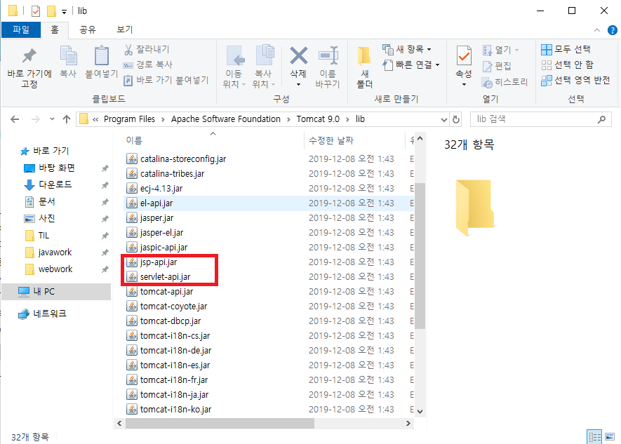

# Servlet

> 웹 상에서 자바코드가 실행되게 만들어주는 기술
>
> 서블릿은 클라이언트 페이지에서 발생하는 클라이언트의 요청을 처리하기 위한 기술
>
> ---
>
> 클라이언트로부터 요청이 전달되면 서버에서 실행되며 DB연동이나 서버의 자원을 엑세스하여 만들어진 결과를 클라이언트로 응답한다.
>
> ---
>
> 클라이언트의 요청을 인식하고 실행되도록 하기 위해서는 서블릿은 정해진 규칙대로 작성이 되어야 하고 서버가 서블릿을 찾아서 실행할 수 있도록 정해진 위치에 작성되어야 한다.
>
> ---
>
> 서블릿 객체는 **딱 한 번**만 메모리에 올라간다.
>
> ---
>
> **정해진 위치란?** 
>
> 표준화된 폴더 구조안에 있는 classes 폴더([서블릿 디렉토리](https://blog.naver.com/heaves1/221588663214)) - **시험문제1**

* 사용하는 라이브러리

  

* 서블릿 객체의 소멸

  * WAS의 reloading
  * Context의 reloading
  * 서블릿 컴파일

## Servlet 작성규칙

> 누가 실행해도 작동이 되어야 하기 때문에 작성 규칙이 존재한다.

* 표준화된 폴더 구조 안에서 서블릿 디렉토리에 저장되어야 한다.

  * classes 폴더

    ---

    ```markdown
    C:\iot\work\webwork\.metadata\.plugins\org.eclipse.wst.server.core\tmp0\wtpwebapps에서 찾는다.
    
    위의 경로 + serverweb\WEB-INF\classes에 작성되어야 한다.
    => 이 위치에 서블릿 클래스가 없으면 못 찾는다.
    ```

* public 클래스로 작성해야 한다.

  ```markdown
  서버가 찾아서 실행해야 하기 때문
  ```

* 서블릿 클래스를 상속해야 한다.

  ```markdown
  우리가 작성한 서블릿 클래스를 서버가 찾아서 생성하고 호출하기 위해서는 
  서버가 인식할 수 있는(서버가 사용할 수 있는) 타입이어야 하므로 
  **서버에 등록된 타입으로 서블릿 클래스를 작성**한다.
  ```

  ```markdown
  Servelet(Interface)
  	^
  	l
  GenericServlet	- 일반적인 내용을 담고 있는 서블릿
  	^
  	l
  HttpServlet		- http프로토콜에 특화된 내용을 담고 있는 서블릿
  	^
  	l
  MyServlet		- 내가 하고 싶은 일이 기술된 서블릿(**개발자가 만드는 서블릿**)
  ```

* 서버가 호출하는 메서드를 오버라이딩 해야 한다.

  ```markdown
  서블릿 클래스는 일반 클래스를 사용하는 방법처럼 객체생성해서 사용하는 클래스가 아니다.
  **서블릿이 호출되면 서버가 서블릿 객체를 생성하고 적절한 시점에 따라
  메서드를 자동으로 호출**한다.
  즉, 서블릿의 Lifecycle을 서버가 관리한다. 
  		  -----------
  		  객체를 생성하고 소멸시키는 것
  ```

  ```markdown
  서버가 적절한 시점에 따라 자동으로 메서드를 호출할 때 원하는 작업을 처리하기 위해서는
  **서버가 호출하는 메서드를 오버라이딩해서 내가 원하는 내용을 기술**해야 한다.
  ```

  * 오버라이딩할 메서드

    * `init` : 서블릿이 초기화 될 때 호출

    * `service` : 클라이언트가 요청을 하면 호출되는 메서드

      ```markdown
      클라이언트의 요청을 처리할 수 있는 내용을 기술
      ex) 로그인, 게시판 목록 보기, 회원가입.....
      ```

    * `doGet` 

      : `service`와 동일하게 동작하며 클라이언트가 get방식으로 요청하는 경우에만 호출

    * `doPost`

      : `service`와 동일하게 동작하며 클라이언트가 post방식으로 요청하는 경우에만 호출

    * `destroy` : 서블릿 객체가 소멸될 때 (메모리에서 해제될 때) 호출

* 서블릿을 등록

  ```markdown
  서버가 서블릿을 찾아서 실행할 수 있도록 서블릿을 web.xml에 등록하는 작업
  										--------
  										서블릿에 대한 내용을 등록하는 설정파일
  ```

  1. 서블릿 등록

     ```xml
     <!-- 사용할 서블릿이 어떤 클래스인지 web.xml에 정의 --> 
     <servlet>
       	<servlet-name>서블릿 이름(alias)</servlet-name>
       	<servlet-class>실제 사용할 서블릿클래스(패키지 포함)</servlet-class>
     </servlet>
     ```

     ```xml
     <!-- ex) basic 패키지에 작성한 FirstServlet을 first라는 이름으로 등록 --> 
     <servlet>
       	<servlet-name>first</servlet-name>
       	<servlet-class>basic.FirstServlet</servlet-class>
     </servlet>
     ```

  2. 서블릿 매핑

     ```xml
     <!-- 서블릿을 어떤 url로 요청할지 등록 -->
     <servlet-mapping>
       	<servlet-name>미리 등록한 서블릿의 이름</servlet-name>
       	<url-pattern>요청 url(반드시 '/' 나 '.'으로 시작)</url-pattern>
     </servlet-mapping>
     ```

     ```xml
     <!-- ex) 위에서 등록한 first서블릿을 /first.multi로 요청 --> 
     <servlet>
       	<servlet-name>first</servlet-name>
       	<servlet-class>/first.multi</servlet-class>
     </servlet>
     ```

## Servlet 요청 방법

* get 방식으로 요청

  * 주소표시줄에 입력하고 요청

    > 테스트 용으로 사용

    ```markdown
    					server.xml에 등록한 path, 보통은 context명
    					------------
    http://localhost:8088/serverweb/first.multi
                             		-----------
                             		web.xml에 등록한 요청 path
                             		<url-pattern>에 등록
    ```

  * 하이퍼링크를 클릭

    ```html
    <a href="http://서버ip:port/contextpath/서블릿요청url">하이퍼 링크</a>
    <a href="/contextpath/서블릿요청url">하이퍼 링크</a>
    ```

  * `<form>`태그에서 method속성을 "get"으로 설정하고 submit버튼 선택

    > `action`속성에 설정한다.
    >
    > `form`태그를 정의하면서 method속성을 생략하면 get방식으로 요청된다.
    >
    > submit버튼을 눌러서 요청하면 `<form>`태그의 action속성에 정의한 서블릿이 요청(서블릿이 호출되어 실행되도록 한다.)되며 `<form></form>`내부에 정의한 모든 양식태그들의 `name`과 `value`가 서블릿으로 전달된다.

    ```html
    <form method="get" action="/contextpath/서블릿요청url">
        <input type="submit" value="전송"/>
    </form>
    ```

* post 방식으로 요청

  * `<form>`태그에서 method속성을 "post"으로 설정하고 submit버튼 선택

  >`action`속성에 설정한다.
  >
  >submit버튼을 눌러서 요청하면 `<form>`태그의 action속성에 정의한 서블릿이 요청(서블릿이 호출되어 실행되도록 한다.)되며 `<form></form>`내부에 정의한 모든 양식태그들의 `name`과 `value`가 서블릿으로 전달된다.

  ```html
  <form method="post" action="/contextpath/서블릿요청url">
      <input type="submit" value="전송"/>
  </form>
  ```

* 요청방식

  * get

    : 요청할 때 입력하는 내용이 url뒤에 추가되어 전송되는 양식

      (요청메시지 헤더에 추가)

      클라이언트가 입력하는 내용이 그대로 노출된다.

      전송할 수 있는 데이터의 크기에 제한이 있다.

    > 게시판 목록 확인하기, 상품정보 가져오기, 검색하기......

  * post

    : 요청메시지 body에 추가되어 전송되므로 클라이언트에 노출되지 않지만

      툴을 이용하면 확인할 수 있으므로 암호화해서 전송해야 한다.

      보낼 수 있는 데이터 크기에 제한이 없다.

      서버의 값을 클라이언트가 원하는 값으로 update(변경)하는 경우

    > 회원등록(insert), 회원정보 수정하기(update), 파일업로드, 메일쓰기....

## 클라이언트가 전달하는 요청 메시지에서 클라이언트의 입력 정보를 추출하기

## DB 연동

