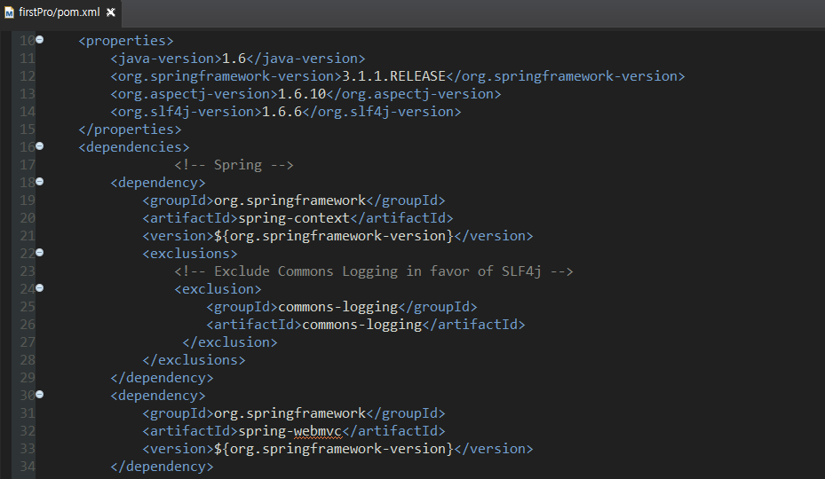
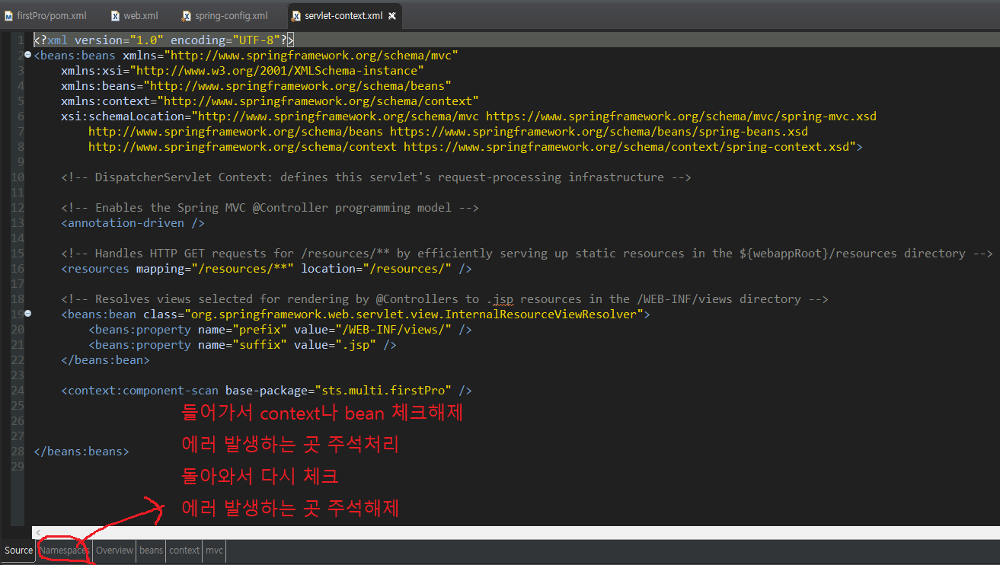

# maven 라이브러리 등록

* `dependency`태그를 통해 라이브러리를 등록한다.

  

> 단, [maven 사이트](https://mvnrepository.com/)에서 지원하는 repository만 `dependency`태그를 통해 등록이 가능하다.
>
> `groupId`,`artifactId`,`version`의 정보가 정확히 일치해야 로딩이 된다.

* 오류 발생 시!

  * 방법 1
  
    
  
  * 방법 2
  
    : user 경로에 있는 .m2 폴더 안 repository폴더를 날린 후 `dependency` 등록 과정을 진행한다.