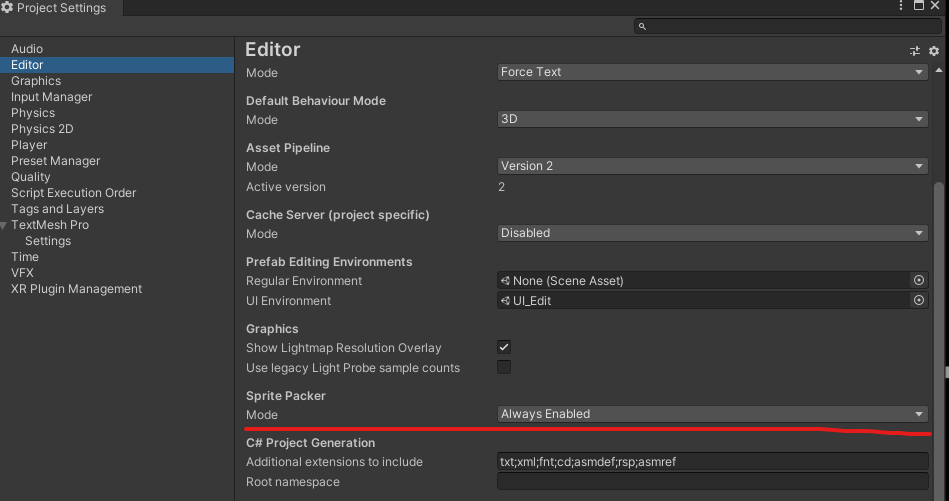
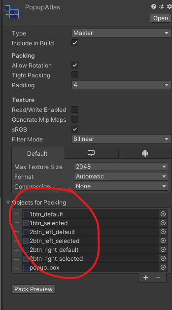
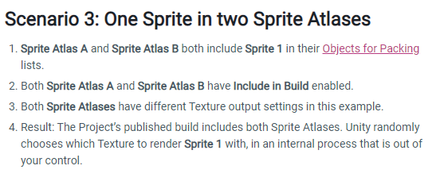
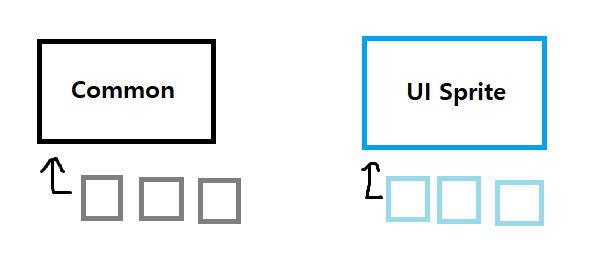

# Sprite Atlas

> 유니티에서 [DrawCall](https://docs.unity3d.com/kr/530/Manual/DrawCallBatching.html)을 줄이기 위해 제공하는 기능으로, 여러 Sprite가 있을 시 하나씩 그려주는 것이 아니라 한 Atlas로 묶어 그릴 수 있게 하는 기능이다.

## 사용방법 

### 1. 기본 `Sprite Atlas` 사용하기

* `Sprite Atlas` 사용 설정하기

  > `Edit -> Project Settings -> Editor -> Sprite Packer`모드를 `Always Enabled`로 변경한다.
  >
  > * 모드 설정은 [여기](https://docs.unity3d.com/Manual/SpritePackerModes.html) 참고

  

* 원하는 경로에 `Sprite Atlas`를 생성해준다.

* 생성된 `Atlas`에 같이 그려져야 하는 `Sprite`를 추가해준다.

  

  * 같이 모아야 하는 `Sprite`는 어떻게 구분할까?

    > 동작이 같이 진행되는 `Sprite`들이나 하나의 `Scene`에서 같이 그려지는 `UI`들은 `Atlas`를 통해 한 번에 그려주면 `Batch`수를 줄여 성능향상을 기대할 수 있다.
    >
    > 단, 알파 텍스처가 사용되는 이미지는 `Atlas`를 사용하는 것이 이득인지 확인이 필요하다.

### 2. 같은 이미지가 여러 개의 `Atlas`에 쓰였을 때 사용하기 [참고](https://docs.unity3d.com/Manual/SpriteAtlasScenarios.html)



> 게임 내에서 확인 버튼은 여러 화면에서 쓰일 수 있다. 팝업창, 선택창, 설정창 등 다양한 곳에서 필요로 하기 때문이다.
>
> 하지만 확인 버튼을 하나의 `Atlas`에 묶어서 패킹한다면 다른 곳에서 확인 버튼을 사용할 때 사용하지  않는 이미지까지 포함해서 로드해야한다는 단점이 있다. 
>
> 이런 경우에는 어떤식으로 `Sprite Atlas`를 구분해주어야 할까?

* 유니티에서 랜덤으로 여러 `Atlas`중 하나를 선택한다.

  : 만일 똑같은 이미지가 A와 B 아틀라스에 포함되어 있다면 해당 이미지를 사용할 때, 유니티 내부적으로 무작위 선택을 하게 되어있다.
  
  따라서 유저는 A에서 불러온 이미지인지, B에서 불러온 이미지인지 알 수 없다.
  
* `Include In Build`옵션을 체크 해제 후, 스크립트 내에서 어떤 Atlas를 사용할 것인지 지정한다.

  ```c#
  SpriteAtlas.GetSprite(string name);
  ```

  ```markdown
  이 메서드를 이용하면 지정한 Atlas에서 해당 Sprite를 로드할 수 있다.
  하지만 이 방법을 사용하면 Sprite를 사용하는 모든 객체에서 이 형식을 사용해야 하므로 좋은 방법은 아니다.
  ```
  
* 공통 `Sprite`와 특정 Scene에서 사용하는 UI를 구분한다.

  

  ```markdown
  이런식으로 사용해서 어떤 UI를 사용하더라도 `공통으로 사용되는 UI들은 Common을 통해서`, 해당 UI만 사용하는 `특정 Sprite는 해당 Atlas를 통해서` 가져오도록 Atlas를 묶어준다.
  ```

  