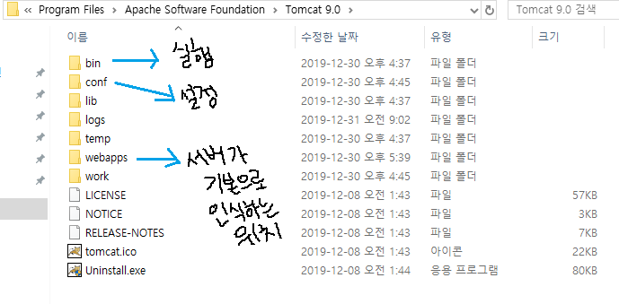
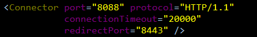
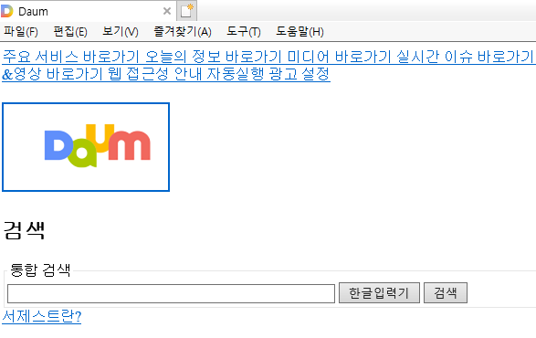

# Web

* Web Server

  : 웹 상에서 작업할 수 있는 프로그램이 설치된 pc

* IIs apache, tomcat

  : 웹 서버 실행 프로그램

* 서버기술 Application

> Php, Asp, jango... 자바에서는 servlet, jsp
>
> 웹 서버와 DB Server를 연결해주는 프로그램

## 웹 요청 방식

* ip

  : 컴퓨터의 주소

  ```markdown
  http://**127.0.0.1**:8088/
  ```

* port

  : 해당 ip에 접속할 수 있는 입구라고 생각하면 된다.

    기본 port는 80이고 생략이 가능하다.

  ```markdown
  http://127.0.0.1:**8088**/context명/폴더명.../요청할 web application
  ```

  기본 context는 생략(root)

  => http://127.0.0.1:8088

  ```markdown
  http://127.0.0.1:8088/docs/index.html
  ```

   -> docs 폴더에 있는 index.html 페이지를 요청한다

  ※ **http**는 프로토콜이다.

* 도메인

  : 이름으로 mapping된 ip에 접근할 수 있게 해준다.

## WAS

>Web Application Server
>
>자바언어를 실행하고(컨테이너) 웹 상의 작업도 같이 할 수 있도록 도와주는 프로그램

### Tomcat 설치

* apache.org

  > tomcat 9 [32-bit/64-bit Windows Service Installer](http://mirror.apache-kr.org/tomcat/tomcat-9/v9.0.30/bin/apache-tomcat-9.0.30.exe) ([pgp](https://www.apache.org/dist/tomcat/tomcat-9/v9.0.30/bin/apache-tomcat-9.0.30.exe.asc), [sha512](https://www.apache.org/dist/tomcat/tomcat-9/v9.0.30/bin/apache-tomcat-9.0.30.exe.sha512)) 설치
  >
  > 설치 과정에서 포트번호를 설정하는데 일단 임의로 번호를 부여한다.
  >
  > -> 8080은 window10의 기본 포트이기 때문에 사용할 수 없다.

* 시작 후 Monitor Tomcat 실행

  > 작업 표시줄에 아이콘 오른쪽 클릭 후 start service

  * C:\Program Files\Apache Software Foundation\Tomcat 9.0\webapps\ROOT에 있는 index.jsp 파일을 수정해 첫 페이지를 수정할 수 있다.
  
  **※** 혹시 실행이 안된다면 위 경로에 관리자 권한이 허락되어 있는지 확인
  
* [Tomcat 폴더 구조](https://blog.naver.com/heaves1/220833476759) = 기본 Context



* conf 폴더

  * server.xml

    : conf 폴더 내부 server.xml은 설치한 tomcat의 설정 파일이다. 파일을 열어보면 설치 시 설정한 내용을 볼 수 있다.

    

  * xml의 내용이 변경되면 무조건 서버를 내렸다 올려야 수정사항이 적용된다.

* logs 폴더

  : 사용한 모든 활동 내용이 기록된다. 에러가 발생한 내역도 확인할 수 있다.

* WEB-INF 폴더

  * web.xml

    : Context 설정 파일

  * lib(라이브러리)

    : 외부 라이브러리는 이곳에 넣어야 인식한다.

  * classes

    : 자바파일(.class), 서블릿, DAO, DTO, 로직

**<커스텀 Context 구성>**

* 바로 아래엔 jsp, html, js, css, image 같은 것들을 넣을 수 있다.
* WEB_INF 폴더와 내부에 web.xml 설정파일이 존재해야 한다.
* 위의 표준화된 구성 규칙을 지켜서 만들어야 한다. 

## View

> 사용자에게 보여지는 화면
>
> html, css, javascript, jquery 등을 사용해 구현한다.

* [html](html.md) 

  : 사용자에게 보여지는 구성요소를 만듬



```html
<!DOCTYPE html>
<html>
<head>
<meta charset="EUC-KR">
<title>Insert title here</title>
</head>
<body>
	<h1>안녕 ~~~</h1>
    <h2>좀 더 작은 글자</h2> 
    <!-- 이런식으로 태그를 지정하고 그 안에 내용을 쓸 수 있다 
		 당연히 태그를 열고 닫는 순서는 지켜져야 한다. -->
</body>
</html>
```

이런 형식을 가진다. => "Markup Language"라고 부른다

* css

  : client style sheet 라고 하며 디자인 적 요소를 추가할 수 있는 언어


* javaScript

  : 반응형 웹 페이지를 만들 수 있게 해준다. (대화형 페이지)

즉, 뼈대(html), 살(css), 움직임(javaScript)을 구현하는 과정이라고 말할 수 있다.

## Java web project

* Dynamic Web Project

> 이클립스에서 실행할 수 있는 웹 프로젝트

* 서버가 인식하는 웹 프로젝트 경로 ↓

  C:\iot\work\webwork\.metadata\.plugins\org.eclipse.wst.server.core\tmp0\wtpwebapps

  프로젝트 경로 안 .metadata 폴더를 통해 **자동으로 만들어진 기본 형식의 경로**를 볼 수 있다.

  ※ 자세한 [프로젝트 생성 과정](https://blog.naver.com/heaves1/220467437111)

* Ant

  > 이클립스 올드 버전의 자동 빌드 툴
  >
  > 작성한 .html, .css, .class 등의 파일들을 서버가 인식하는 위치로 **자동 빌드**해주는 **툴**이라고 생각하면 된다.

    가끔 제대로 작동이 되지 않아 자동으로 넘어가지 않는 경우가 있으므로 서버 인식 경로에 

    있는 파일의 **최근 수정 시간**이 내가 작업한 시간인지 잘 **확인**해야 한다.


