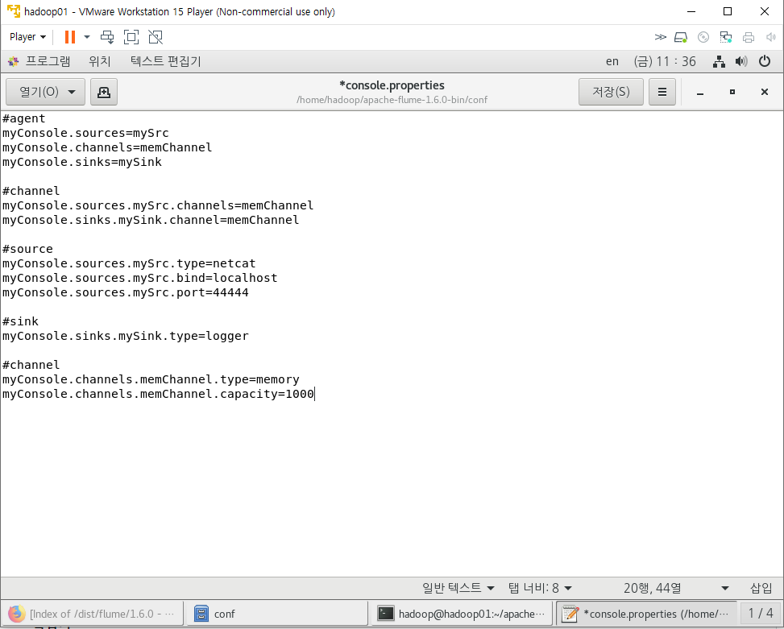

# Flume

> 데이터를 추출하기 위해 사용되는 프로그램
>
> 시스템로그, 웹 서버의 로그, 클릭로그, 보안로그.. 비정형데이터를 HDFS에 적재하기 위해 사용하는 프로그램
>
> 대규모의 로그데이터가 발생하면 효율적으로 수집하고 저장하기 위해 관리해줄 수 있는 프로그램 필요

* flume, chukwa, scribe, fluented, splunk

## 설정방법

1. 다운로드(압축풀기)

   * `wget http://archive.apache.org/dist/flume/1.6.0/apache-flume-1.6.0-bin.tar.gz`
   * `tar -zxvf apache-flume-1.6.0-bin.tar.gz`

2. `.bashrc`에 설정 정보 등록

   * 터미널에서 `source .bashrc`로 실행

3. flume-env.sh 등록

   > conf 폴더 안 `flume-env.sh.template`을 사용
   >
   > `.template`이 붙어 있으면 설정파일로 인식하지 못한다.
   >
   > cp 명령어를 통해 복사본을 만들어 사용한다.

   * `cp flume-env.sh.template flume-env.sh`(rename)

     >**export JAVA_HOME**=/usr/java/jdk1.8.0_231-amd64
     >**HADOOP_HOME**=/home/hadoop/hadoop-1.2.1

     위 내용을 추가해준다.

4. flume 설정 파일 등록

   * `cp flume-conf.properties.template console.properties`(rename)
   * flume agent의 source, channel, sink에 대한 정보를 등록

   

5. tomcat 설치

   > tomcat9 tar.gz 파일을 "링크 주소 복사"로 선택한 뒤
   >
   > hadoop02의 하둡 계정에서 `wget`명령을 이용해 다운로드
   >
   > `tar -zxvf`명령으로 압축풀기

6. hadoop02의 .bashrc 수정

   >**export** `HADOOP_COMMON_HOME=/home/hadoop/hadoop-1.2.1`
   >
   >**export** `HADOOP_MAPRED_HOME=/home/hadoop/hadoop-1.2.1`
   >
   >
   >
   >**export** `JAVA_HOME=/usr/java/jdk1.8.0_231-amd64`
   >
   >**export** `JAVA_OPTS="-Dfile.encoding=UTF-8"`
   >
   >**export** `CATALINA_HOME=/home/hadoop/apache-tomcat-9.0.31`
   >
   >**export** `CLASS_PATH=.:$JAVA_HOME/lib/too.jar:$CATALINA_HOME/lib/jsp-api.jar:$CATALINA_HOME/lib/servlet-api.jar`
   >
   >**export** `PATH=$PATH:$JAVA_HOME/bin:$CATALINA_HOME/bin`

7. tomcat 실행

   > 터미널의 bin 폴더 내에서 `startup.sh`로 시작
   >
   > `shutdown.sh`로 종료

## Flume의 구성요소

> flume의 실행중인 프로세스를 agent라 부르며 source, channel, sink로 구성

* source

  > 데이터가 유입되는 지점(어떤 방식으로 데이터가 유입되는지 type으로 명시)
  >
  > **agent명.sources.source명.type=값**

  * type

    * netcat 

      : telnet을 통해서 터미널로 들어오는 입력데이터

       (bind : 접속IP, port : 접속할 port)

    * spoolDir

      : 특정 폴더에 저장된 파일

       (spoolDir : 폴더명)

* channel

  > 데이터를 보관하는 곳(source와 sink 사이의 Queue)

* sink

  > 데이터를 내보내는 곳(어떤 방식으로 내보낼지 정의)

  * type

    * logger

      : flume서버 콘솔에 출력이 전달

       flume을 실행할 때 

      `-Dflume.root.logger=INFO,console`를 추가

    * file_roll

      : file을 읽어서 가져오는 경우

       (directory : 읽어온 파일을 저장할 ouput폴더를 명시)

## Flume의 실행

* `./bin/flume-ng agent --conf conf --conf-file ./conf/console.properties --name myConsole -Dflume.root.logger=INFO,console`

  > apache-flume-1.6.0-bin 디렉토리 안에서 실행할 때 ↑

  * 실행명령어: `.bin/flume-ng agent`

  * 옵션

    * --conf : 설정파일이 저장된 폴더명(-c)
    * --conf-file : 설정파일명(-f)
    * --name : agent의 이름(-n)

  * `Dflume.root.logger=INFO,console` 

    : flume의 로그창에 기록
    
    **=> 콘솔에서만 가능하다**
  
* `./bin/flume-ng agent -c ./conf/ -f ./conf/hdfs.properties -n myhdfs`

  * -n : agent 이름
  * -c : the config directory
  * -f :  the config file

## Flume의 특징

* flume은 메모리가 부족하면 결과가 제대로 나오지 않을 수 있다.