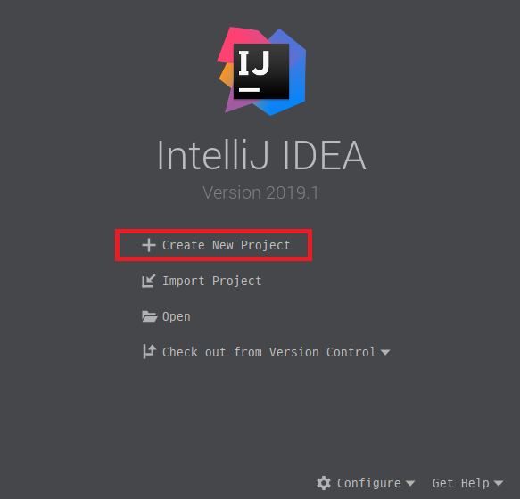
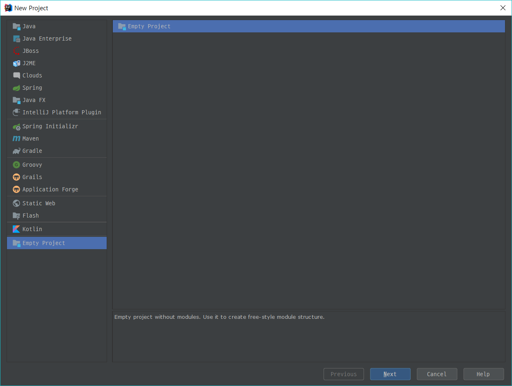
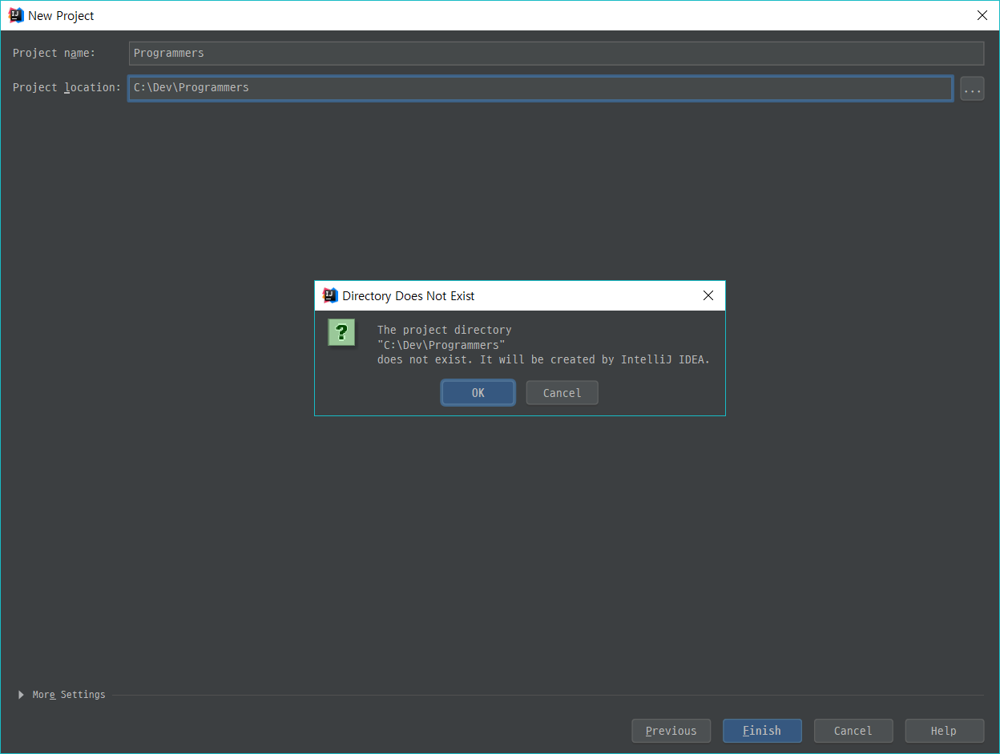
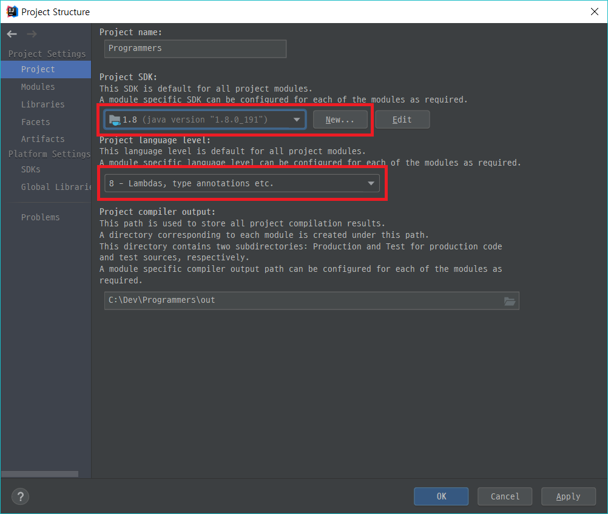
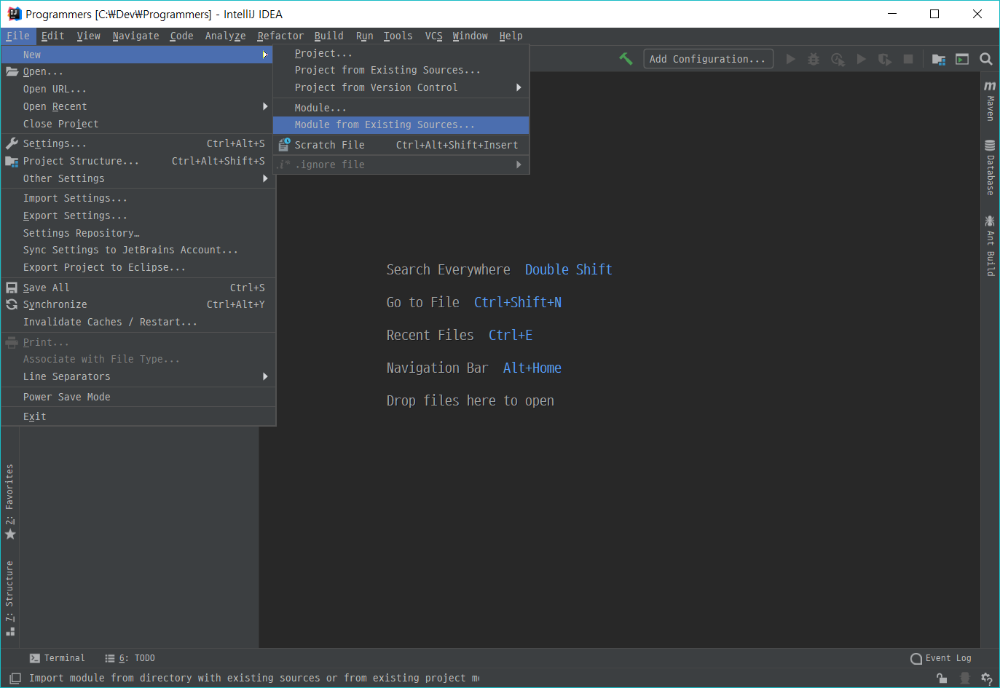
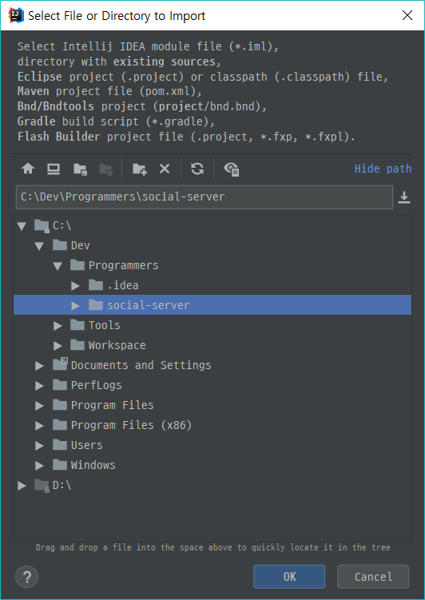
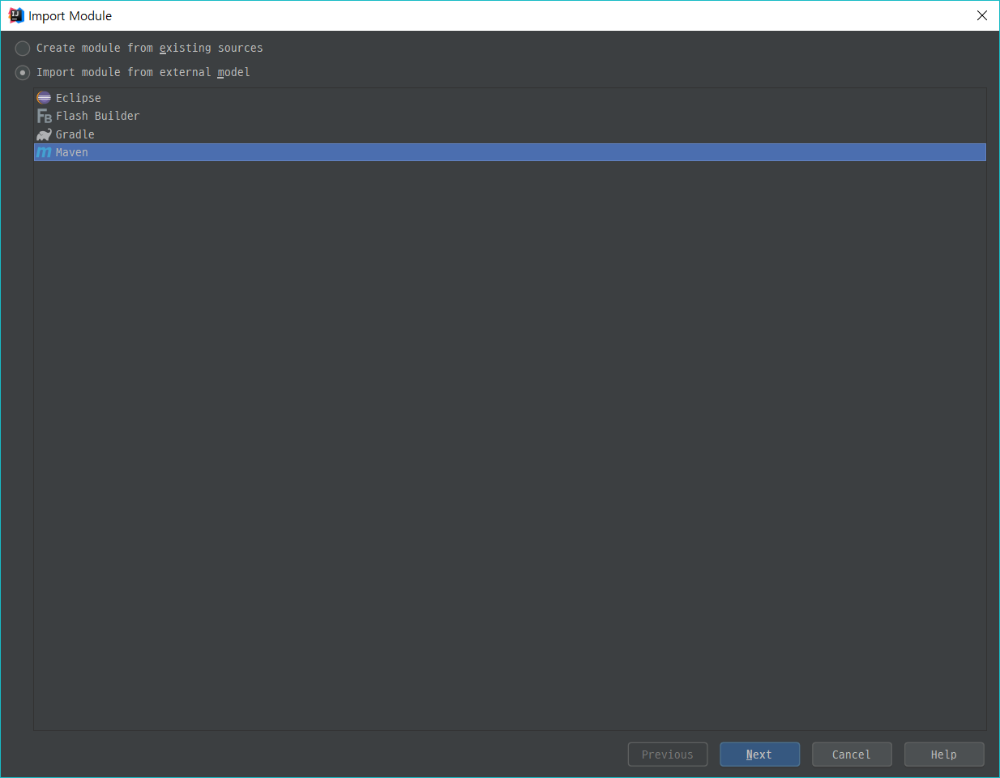
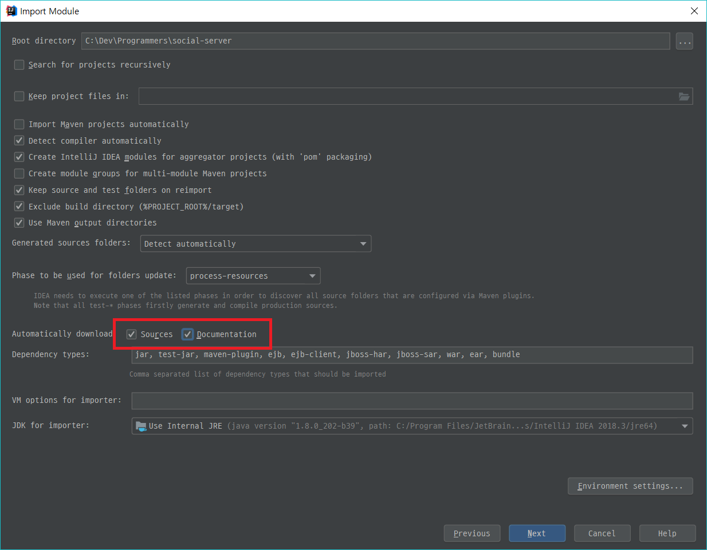
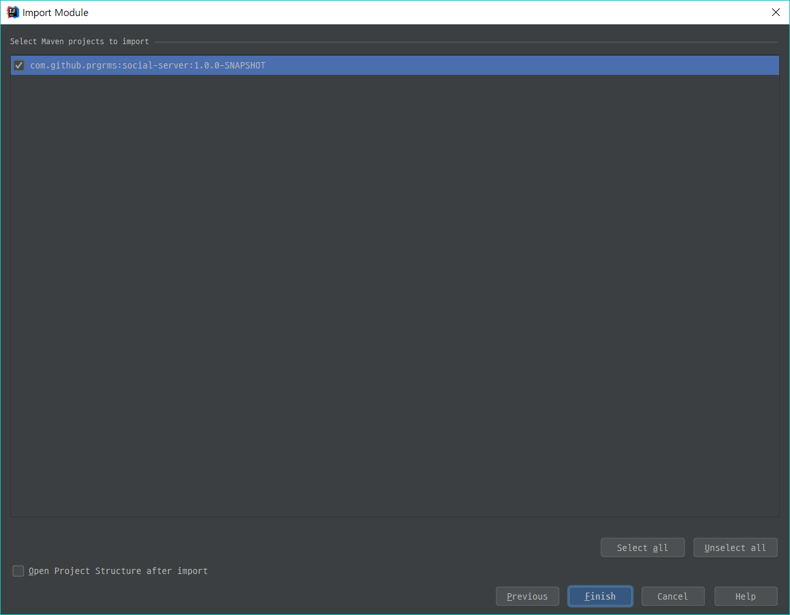
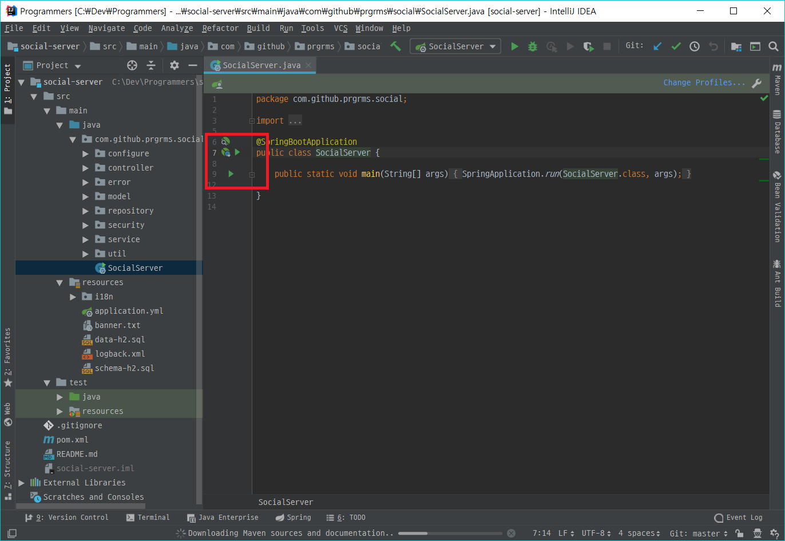

## 2주차 브랜치 가져오기

>git clone https://github.com/learn-programmers/prgrms-web-bjs-8.git
>cd prgrms-web-bjs-8
>git checkout class/#2

## IntelliJ에서 Maven 프로젝트 시작하기

##### *Create New Project* 버튼을 클릭합니다.

##### 비어있는 프로젝트를 생성합니다.

##### 프로젝트 Root 디렉토리를 지정합니다. 디렉토리가 없는 경우 자동으로 생성됩니다.

##### 시스템 JDK 경로를 지정하고, 기본 컴파일 레벨을 8로 지정해줍니다.

##### 상단 메뉴에서 *File > New > Module from Existing Source* 를 선택합니다.

##### 프로젝트 Root 디렉토리에 GitHub에서 Clone한 프로젝트를 준비하고 선택합니다.

##### *Import module from external model*을 선택하고 *Maven*을 선택한 후 Next를 클릭합니다.

##### Source와 Documentation을 체크하면 오픈소스 소스코드와 문서를 자동으로 다운로드합니다. (선택)

##### Import하는 Maven 프로젝트의 groupId, ArtifactId, Version을 확인할 수 있습니다.

##### SocialServer 좌측의 초록색 삼각형 버튼을 클릭하면 프로젝트를 실행할 수 있습니다.

프로젝트가 정상적으로 실행되면 브라우저에 [http://localhost:8080을](http://localhost:8080을/) 입력 후 첫 페이지에 진입할 수 있습니다.

