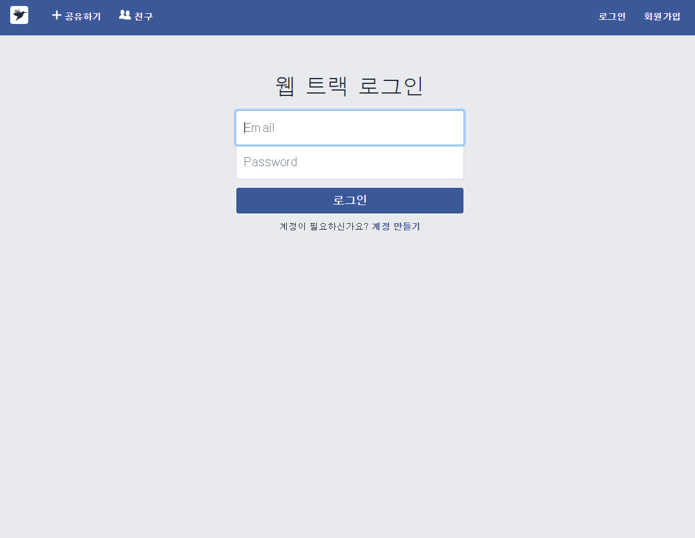
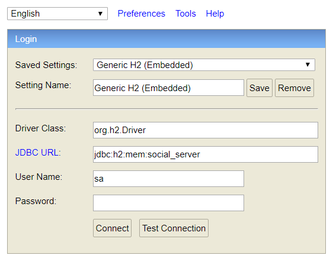
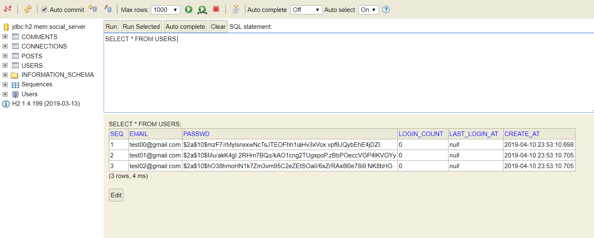

*class/#2* 브랜치를 clone 한 후 프로젝트를 실행 합니다. (Maven 프로젝트가 익숙하지 않다면 이전 [강의 노트](https://school.programmers.co.kr/courses/10963/lessons/69952) 를 참고하세요)

프로젝트 실행은 mvn 명령 또는 IDE에서 직접 실행할 수 있습니다.

- maven 으로 프로젝트 실행하기
  - (pom.xml 파일이 있는 경로에서) mvn clean compile spring-boot:run
- IDE로 실행하기
  - IntelliJ - https://www.youtube.com/watch?v=397QPCAjm0o
  - Eclipse - https://www.youtube.com/watch?v=Bro59wWFOgo

프로젝트 실행 완료 후 브라우저에 [http://localhost:8080](http://localhost:8080/) 을 입력하면 아래와 같은 화면을 볼 수 있습니다.

로그인 아이디 비밀번호는 [test00@gmail.com](mailto:test00@gmail.com) / 1234 입니다. 회원가입을 통해 자신만의 계정을 만들수도 있습니다. 다만 프로젝트 중지 후 재실행시 기본값을 제외한 데이터는 모두 초기화 됩니다.

본 프로젝트는 데이터베이스로 [H2](https://www.h2database.com/)를 사용합니다. 프로젝트 실행 후 스키마 확인 및 간단한 SQL 실행 테스트를 위해 [H2-Console](http://localhost:8080/h2-console)을 이용할 수 있습니다.

- [스키마](https://github.com/learn-programmers/prgrms-web-bjs-8/blob/class/%232/src/main/resources/schema-h2.sql)
- [기본데이터](https://github.com/learn-programmers/prgrms-web-bjs-8/blob/class/%232/src/main/resources/data-h2.sql)

초기 설정 그대로 *Connect* 버튼을 클릭하면 아래와 같은 화면에서 스키마 확인 및 SQL 실행이 가능합니다.

