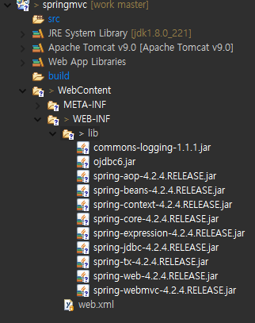
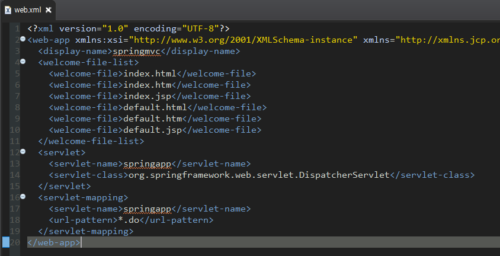

# 스프링 mvc 프로젝트 구성(maven X)

1. Dynamic Web Project생성

2. 라이브러리를 lib폴더에 복사하기

   

3. `DispatcherServlet`을 web.xml에 등록

   => 모든 요청이 `DispatcherServlet`을 통해 진입하도록 설정해야 스프링이 제공하는 여러 가지 기능을 적용할 수 있다.(**frontController 패턴**이 적용되어 있다.)

   
   
4. spring에서 사용할 설정파일을 작성한다.

   => 따로 등록하지 않으면 web프로젝트에서 사용할 스프링설정 파일은 파일명을 작성할 때 규칙이 있다.

   > [`DispatcherServlet`을 등록한 서블릿명] - servlet.xml
   >
   > ex) 서블릿명 : springapp
   >
   > ​		**/WEB-INF/springapp-servlet.xml**

5. 배포 후 Tomcat 서버 재시작

6. `Controller` 작성하기

   * 기본 web에서 서블릿과 같은 역할을 하는 클래스
   * 실제 처리를 담당하는 클래스

7. spring 설정파일에 컨트롤러 등록하기

   > `<bean>` 태그를 이용해서 6번에서 생성한 컨트롤러 등록하기
   >
   > 요청path를 기준으로 컨트롤러를 등록할 것이므로 id속성을 쓰지 않고 name속성을 사용한다.
   >
   > `DispatcherServlet`내부에서 요청path에 맞는 컨트롤러를 `getBean` 할 수 있도록 등록
   >
   > [형식]
   >
   > `<bean name="요청path" class="컨트롤러 클래스"/>`
   >
   > [예제]
   >
   > /test.do로 `TestController`를 요청
   >
   > `<bean name="/test.do" class="test.TestController"/>`

# spring mvc 구성요소

> 스프링MVC를 구축하고 웹을 실행
>
> 스프링이 제공하는 모든 편리한 기능을 잘 활용하기 위해서 스프링이 내가 작성한 자바빈을 관리할 수 있도록 작업해야 한다. 
>
> (스프링 내부의 컨테이너가 내가 작성한 빈을 생성하고 관리할 수 있도록 작업)
>
> ---
>
> 이를 위해 모든 요청이 `DispatcherServlet`이라는 서블릿을 통해 들어올 수 있도록 처리 

1. `DispatcherServlet`

   : 클라이언트의 모든 요청을 처리하기 위해 첫번째로 실행되는 서블릿

2. `HandlerMapping`

   : 클라이언트가 요청한 path를 분석해서 어떤 컨트롤러를 실행해야 하는지 찾아서 `DispatcherServlet`으로 넘겨주는 클래스

3. `Controller`

   : 클라이언트의 요청을 처리하는 클래스

     DAO의 메서드를 호출하는 기능을 정의

4. `ModelAndView`

   : `Controller`에서 DAO의 메서드 호출결과로 만들어진 데이터에 대한 정보나 응답할 view에 대한 정보를 갖고 있는 객체

5. `ViewResolver`

   : `ModelAndView`에 저장된 view의 정보를 이용해서 실제 어떤 view를 생성해야 하는지 정보를 넘겨주는 객체

> => 스프링 MVC를 구축하면 위의 클래스들이 자동으로 실행되며 일처리를 한다.
>
> 따라서 필요에 따라 스프링에서 지원하는 `ViewResolver`나 `HandlerMapping`객체를 다양하게 등록하고 사용할 수 있다.
>
> ---
>
> => 기본 설정을 이용하는 경우 개발자는 `Controller`만 작성하고 설정파일이나 어노테이션으로 등록하면 된다.